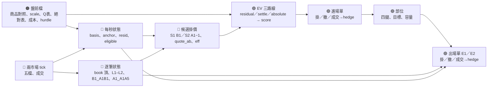

> 2026-09-29：RD實作請改讀 [新版交易規格](12_RD_TRADING_SPEC.md) 及 [盤前交付清單](13_RD_PREMARKET_HANDOFF.md)。本文保留歷史設計，其中EV、部分成交、出場槽、anchor、重掛及到期實盤描述均不可直接當作採用版實作。
>
> 2026-09-23 整理：現行規則與驗證狀態見 [CURRENT.md](CURRENT.md)。本文件保留前一階段規格／結果；其中數字未包含本次新增的每路線 60 秒更新，不可直接視為本次驗收。

# spreadArb 期現價差 maker 策略（交易邏輯）

**版本註記（2026/9/22）**：本文保留修正前的策略／線上設計說明，不再代表現行回測的完整實作契約。
9/22 全額預留變體見 [04_CORRECTED_REPLAY.md](04_CORRECTED_REPLAY.md)；
正值 max-Q 出場使用同目標的 reach EV；B 使用持倉與容量篩選前的獨立訊號；未完成 hedge 保留曝險並重試。
**9/23 更正**：本文「working 單不預留」符合使用者確認的容量政策，不能因此判錯。
當前資金時序規則以 [05_CAPITAL_POLICY_CLARIFICATION.md](05_CAPITAL_POLICY_CLARIFICATION.md) 為準；第 15 節仍為舊版差異表。
**9/23 掛單補充**：使用者確認同商品 S1／S2／E1／E2 各最多一張、四種可同時掛；持有部位不限筆數。
第 3.1／7.1 節的進場忙碌判斷應按 `(商品, S1 或 S2)` 分開，不是 S1／S2 互斥。
E1／E2 仍各服務最早可出場部位；詳見 [掛單數確認](07_QUOTE_CONCURRENCY_CLARIFICATION.md)。

> 文件目的：讓 RD 直接理解策略意圖、資料流、逐秒狀態、EV 決策、委託生命週期（掛單／撤單／hedge／出場）與每日時序。
>
> 不限定實作語言。所有狀態以「交易日 × 商品」隔離；跨日只保留部位（含其出場目標）。
>
> 本文描述修正前點位回放的凍結版 A／B；歷史結果及修正後完整比較見 [`03_RESULTS.md`](03_RESULTS.md)。
> 盤前檔的欄位定義見 [`10_PREMARKET.md`](10_PREMARKET.md)。

---

## 1. 先用一句話理解策略

**在個股期貨與現貨之間，當「期貨相對現貨的溢價（basis）」偏高時，用被動單建立「買現貨、賣期貨」的價差部位，等 basis 回落再用被動單反向平掉；兩腿都以「一腿 maker 成交、50 ms 後另一腿 taker 打掉」完成，不留單邊曝險。**

策略分六層：

1. 盤前載入商品對照、水位尺、Q 表、絕對收斂表、成本表、今日門檻。
2. 每秒更新每檔商品的 basis、anchor（120 秒 EWMA）、殘差；每筆行情更新兩邊 book 與掛單條件狀態。
3. 對每個候選掛價算三條路線的 EV／T，最高者過門檻、容量還有、掛單條件成立，就掛進場單。
4. 掛單期間逐筆檢查撤單觸發；成交後 50 ms 打對向腿 hedge；登記部位與它的出場目標。
5. 每筆部位在兩條出場路線上同時掛被動單（現貨賣／期貨買），先成交者贏，另一單撤，50 ms 後 hedge。
6. 到期日的部位抱到收盤，現貨收盤競價賣出、期貨自然結算。

兩個凍結政策只差門檻：**A** 固定 8.5 bp／交易日；**B** 前一天資金碰頂時抬到昨日訊號的中位數。

---

## 2. 資料來源圖例

| 標籤 | 類型 | 定義 |
|---|---|---|
| <span style="color:#c62828;font-weight:700">● [TICK]</span> | 行情 | 現貨與期貨的逐筆五檔＋成交；`RecvTime`（UTC）、`ChannelSeq`、`TrialMatch`、`BidPrice1..5/BidLots1..5`、`AskPrice1..5/AskLots1..5`、`BestBidPrice/BestAskPrice`（含量）、`FillPrice/FillLots`。 |
| <span style="color:#ef6c00;font-weight:700">● [PRE]</span> | 盤前檔 | `{D}_spreadArb_products.parquet`、`{D}_spreadArb_tables.json`。 |
| <span style="color:#1565c0;font-weight:700">● [CALC]</span> | 策略計算 | book 頂、basis、anchor、殘差、e、掛單條件、候選價、EV。 |
| <span style="color:#6a1b9a;font-weight:700">● [TABLE]</span> | 查表 | Q 表 `c0/c1/q`、絕對表、scale。 |
| <span style="color:#2e7d32;font-weight:700">● [ORDER]</span> | 委託與部位 | 進場單、出場單、hedge 單、部位（四腿、目標）、容量帳。 |
| <span style="color:#455a64;font-weight:700">● [PARAM]</span> | 設定 | 第 13 節。 |

### 2.1 變數索引

| 類型 | 名稱 | 定義 |
|---|---|---|
| [TICK] | `SpotB1/A1`, `SpotB1Q/A1Q`, `SpotB2/A2` | 現貨明掛 L1 與 `Best*` 的較優價（量取較大）；L2 = 次一個有量價位 |
| [TICK] | `FutB1/A1`, `FutB1Q/A1Q`, `FutB2/A2` | 期貨同上；成交列五檔全零時沿用最近一筆有效五檔 |
| [PRE] | `scale`, `expiry`, `k_cal`, `k_td`, `session_offsets`, `settle_offset`, `limit_up/down`, `product_cap_twd`, `tradable` | 盤前檔 |
| [CALC] | `basis_mid`, `basis_buy`, `basis_sell` | 10⁴×(FutMid/SpotMid−1)、10⁴×(FutA1/SpotB1−1)、10⁴×(FutB1/SpotA1−1) |
| [CALC] | `anchor` | 合格秒上 basis_mid 的 120 秒 EWMA（每秒更新） |
| [CALC] | `resid`, `e` | `basis_mid − anchor`、`resid / scale` |
| [CALC] | `eligible` | 該秒合格（[10 §5.2]） |
| [CALC] | `gate_S1buy`, `gate_S2sell`, `gate_E1`, `gate_E2` | 掛單條件（第 6.4 節） |
| [CALC] | `quote_ab`, `eff` | 候選掛價鎖定的 basis；`quote_ab − anchor` |
| [ORDER] | `committed`, `committed[vc]` | 已成交未平部位的現貨名目合計；單商品合計 |
| [ORDER] | position：`stream, vc, qc, shares=2000, entry legs, anchor_entry, scale_entry, route, x, target_bp, ev, score, t_pred` | 第 9 節 |

---

## 3. 全策略資料流



### 3.1 每筆 tick 的處理順序

1. 讀 [TICK]，丟棄重複、倒序、試撮（`TrialMatch != 0`）；更新該市場該商品的 book 頂與 L2。
2. 若這是期貨成交或現貨成交：先跑**成交判定**（我方掛單是否被這筆 print 成交，第 8.3／10.3 節），再跑 hedge 排程。
3. 更新該商品的掛單條件狀態（第 6.4 節）。
4. 對該商品所有 working 的進場單、出場單跑**撤單觸發**（第 8.2／10.2 節）。
5. 若該商品沒有 working 的進場單、且允許進場：算候選掛價 → EV → 決定是否掛（第 7 節）。
6. 對該商品每筆開放部位：若其出場路線沒有 working 單、且觸發條件成立，掛出場單（第 10.1 節）。

每秒整點另有一個定時事件：更新 `anchor`、`resid`、`e`、`eligible`（第 6.1 節）。

---

## 4. 每日時間軸

| 時間 | 動作 | 輸入 | 說明 |
|---|---|---|---|
| 08:15 | 載入 | [PRE] 兩個盤前檔；本地 `positions_{D−1}.json`；券商實際部位 | 盤前檔缺或 manifest 標 failed → 今天不開新倉。部位以券商為準，本地檔只補「出場目標」；對不上的部位告警、人工處理。 |
| 08:45 | 訂閱 | products 檔全部商品（含不可交易者） | 兩市場五檔＋成交。 |
| 09:00 | 開盤 | [TICK] | 開始建每秒狀態；anchor 暖機。 |
| 09:05:00 | 開放掛單 | `sec ≥ 300` | 進場單與出場單都從此刻起；這是沿用的時段設定，未證明09:05前進場較差。來源釐清見[現行RD規格第4.4節](12_RD_TRADING_SPEC.md#44-為什麼不是0901開始或125320後繼續進場)。 |
| 09:05–12:53:20 | 進場 | `300 ≤ sec < 14,000` | 新進場單只在此區間掛；12:53:20 後不再掛新進場單，既有 working 進場單照撤單規則走。 |
| 09:05–13:18 | 出場 | `300 ≤ sec < 15,480` | 出場單可掛到 13:18。 |
| 13:18:00 | 全撤 | | 撤掉所有 working 的 maker 單（進場、出場）。hedge 單（taker）不撤。 |
| 13:20:00 | 到期日收盤處理 | 今日到期的部位 | 現貨用收盤競價（13:25–13:30）市價賣出；期貨到期自然結算，不下單。 |
| 13:35 | 收盤對帳 | 券商部位、成交回報 | 寫 `positions_{D}.json`（每筆開放部位含目標）、`committed_close`（供明天盤前 B 版用）、當日成交明細。部位對不上告警。 |

---

## 5. 輸入契約

### 5.1 tick

- 兩市場都要 `RecvTime`（UTC ns）。跨市場只比 `RecvTime`，同市場內用 `ChannelSeq` 排序。
- 現貨價格為真實價；期貨價格以 `DecimalLocator` 還原。內部價格一律 `int(TWD × 10⁴)`。
- 現貨 `Lots` 為張（× 1,000 股）；期貨 `Lots` 為口。
- 期貨「成交列」五檔可能全零：book 頂只在有五檔的列更新。

### 5.2 盤前檔

見 [10 §4、§7–§9]。交易程式讀取後檢查：`reach.as_of == D`、`absolute.as_of == D`、`hurdle.today_bp_per_day ≥ base`。

---

## 6. 每檔商品的狀態

### 6.1 每秒狀態（整點觸發）

```text
sec = 自 09:00:00 起的秒序
book 頂取「該秒結束前」最後收到的兩邊五檔
eligible = 兩邊正式盤、不交叉、價格在 0.91–1.08 × 參考價、book 60 秒內有更新、sec ≥ 300
basis_mid / basis_buy / basis_sell 依 §2.1
anchor：eligible 時 anchor += α × (basis_mid − anchor)，α = 1 − 0.5^(1/120)；否則不動；第一個 eligible 秒 anchor = basis_mid
resid = basis_mid − anchor；e = resid / scale
```

### 6.2 距到期

`k_cal`、`k_td`、`session_offsets`、`settle_offset` 直接用盤前檔，一天不變。

### 6.3 候選掛價（每筆 tick 可算）

```text
S2（期貨 maker 賣）：P = previous_tick(FutA1)，需 FutB1 < P            # 一 tick 寬的盤口沒有合法價
    quote_ab = 10⁴ × (P / SpotA1 − 1)                                 # hedge 打現貨 Ask
S1（現貨 maker 買）：P = SpotB1
    quote_ab = 10⁴ × (FutB1 / P − 1)                                  # hedge 打期貨 Bid
eff = quote_ab − anchor
tick_bp_hedge = hedge 腿 tick ÷ hedge 腿 L1 價 × 10⁴
```

tick 表（TWD）：`<10 → 0.01；<50 → 0.05；<100 → 0.1；<500 → 0.5；<1000 → 1；其餘 5`；`previous_tick` 跨級距用較低級距。

### 6.4 掛單條件（Stage 4 篩出的「這種狀態不要掛」）

四條腳各一個布林，每筆 tick 重算：

```text
gap_ticks(side) = 該側 L1 與次一有量價位的距離 ÷ tick(L1)；沒有 L2 → ∞
B1_A1B1 = SpotB1Lots / (SpotB1Lots + SpotA1Lots)      # 現貨明掛 L1，Best* 不算；分母 0 → 0.5
A1_A1A5 = SpotA1Lots / Σ SpotA1..A5 Lots

gate_S1buy  = 現貨 eligible 且 期貨 eligible 且 gap_ticks(FutBid) ≤ 1 且 B1_A1B1 < 0.3
gate_S2sell = 現貨 eligible 且 gap_ticks(SpotAsk) ≤ 1 且 A1_A1A5 < 0.2
gate_E1     = 期貨 eligible 且 gap_ticks(FutAsk) ≤ 1
gate_E2     = 現貨 eligible 且 gap_ticks(SpotBid) ≤ 1
```

用途兩個：掛單當下要 true 才掛；掛單期間變 false 就送撤單（第 8.2、10.2 節）。

---

## 7. 進場決策（EV）

### 7.1 何時評估

商品 `tradable`、`300 ≤ sec < 14,000`、該商品沒有 working 的進場單、上一張進場單的 hedge 已完成（或已撤單生效）。
每筆 tick 都可評估；為省算力，同一分鐘內 `(stream, round(quote_ab), round(anchor))` 相同的評估可以快取。

### 7.2 預篩（任一不成立就不評估）

```text
quote_ab > 0
anchor ≥ min_anchor_bp（0）                              # 除息造成的負 anchor 不做
eff ≥ 25 或 quote_ab ≥ 50                                # 殘差夠大，或絕對價差夠大
S2：SpotA1Lots × 1,000 ≥ 5 × 2,000 股                     # hedge 腿深度
S1：只掛 B1（不掛 inside、不掛 B1−1）
gate_{stream} == true
```

### 7.3 三條路線

共用：

```text
d_in    = max(cost.d_in_base[stream], 0) + margin       # 有 override 時用 (stream, tick_b, t_b) 的值
d_out   = max(cost.d_out_base[stream], 0) + margin
d_settle= max(cost.d_settle_base, 0) + margin
g0      = quote_ab − d_in                                # 扣進場滑價後的 basis
today_remaining = (15,600 − sec) / 86,400                # 日曆日
K       = len(session_offsets)                           # 到到期還有幾個交易日
```

**殘差路線**（對每個 `x ∈ {0, −0.25, −0.5, −1.0}`）：

```text
e_b = bucket(e, e_edges)；t_b = bucket(sec, (3600, 9000))；k_b = bucket_left(k_cal, (0, 1, 3))
c0 = 查 C0 ladder (e_b, x, t_b, k_b) → (e_b, x, t_b) → (e_b, x) → (x)；查不到 → 這個 x 沒有估計
c1 = 查 C1 ladder（K ≥ 1 才查；查不到 → c1 = c0）
q  = 查 q ladder（K ≥ 2 才查；查不到 → q = 0）
c1 = max(c0, min(c1, 1))
P_sd   = c0
P_d1   = c1 − c0
P_dj   = (1 − c1) × (1 − q)^(j−2) × q，j = 2..K
P_never= (1 − c1) × (1 − q)^(K−1)
B_x  = anchor + x × scale
G_x  = quote_ab − d_in − B_x − d_out
EV_x = P_sd × (G_x − 20) + (P_d1 + Σ P_dj) × (G_x − 34) + P_never × (g0 − 34)
T_x  = P_sd × today_remaining + Σ_j P_dj × session_offsets[j−1] + P_never × settle_offset
score_x = EV_x / T_x
```

**到期路線**（抱到結算，basis 歸 0）：

```text
EV = g0 − d_settle − 34；T = settle_offset；score = EV / T
```

**絕對路線**（收斂到 0）：

```text
ab_eff = g0；ab_eff < 50 → 沒有這條路
cell = 絕對表 (thr 最近 ab_eff, k_b_td = bucket_left(k_td, (0,2,5,10,15)))，n < 30 退到只按 thr；查不到 → 沒有這條路
G_x = ab_eff − d_out
對 j = 0..15：p = p_day[j]
    j > K → 併入 P_never
    fee = 20（j = 0）或 34；offset = today_remaining（j = 0）或 session_offsets[j−1]
    EV += p × (G_x − fee)；T += p × offset
p_later：K ≥ 16 時 EV += p_later × (G_x − 34)，T += p_later × mean(session_offsets[15:])；否則併入 P_never
P_never = p_settle + 併入者；EV += P_never × (ab_eff − d_settle − 34)；T += P_never × settle_offset
score = EV / T
```

### 7.4 決定

```text
候選 = 所有路線／x 的 (EV, T, score)，EV ≥ ev_min 且 T > 0
best = argmax score
掛單 ⟺ score_best ≥ hurdle_today                          # [PRE] hurdle.today_bp_per_day
容量：committed + notional ≤ cap_twd（20M）
      committed[vc] + notional ≤ product_cap_twd[vc]        # max(1 張, 5M)
      notional = S2：SpotA1 × 2,000；S1：P × 2,000（TWD）
```

進場單一律 1 口（現貨 2 張 = 2,000 股）。`committed` 只算已成交未平的部位，working 單不預留。

部位的出場目標在掛單當下決定並凍結：

```text
route = residual：target = anchor + x_best × scale
route = settle  ：target = 無（抱到結算）
route = absolute：target = max(0, anchor + x_r × scale)，x_r = 殘差路線中 score 最高的 x；殘差路線沒有估計時 target = 0
```

---

## 8. 進場單生命週期

### 8.1 掛單

```text
S2：期貨賣單 @ P = previous_tick(FutA1)，1 口，ROD
S1：現貨買單 @ P = SpotB1，2 張，ROD
掛單當下記錄：quote_ab、anchor、scale、e、sec、route、x、target、EV、score、T_pred
掛出後不追價：P 固定到成交或撤單
```

### 8.2 撤單觸發（每筆 tick 檢查，任一成立立刻送撤）

```text
1. eff_live = quote_ab_live − anchor_live < 20
       quote_ab_live：S2 = 10⁴ × (P / SpotA1 − 1)；S1 = 10⁴ × (FutB1 / P − 1)     # 我方價固定，對向腿用當下
2. quote_ab_live ≤ 0，或 anchor_live < 0
3. 該秒不 eligible（兩邊 book 失效、交叉、超出價格帶、過時）
4. gate_{stream} 變 false
5. sec ≥ 14,000（12:53:20）且尚未成交 → 撤            # 新進場截止
6. sec ≥ 15,480 → 撤（全撤）
撤單送出後到生效前（實測約 50 ms）仍可能成交：成交就照 8.3 處理，不算錯誤（撤單競賽）
撤單生效後，該商品才可再評估新的進場單
```

### 8.3 成交判定與 hedge

```text
S2 成交 = 收到本方期貨賣單成交回報（1 口）
S1 成交 = 現貨買單成交回報；可能部分成交（1 張）
    部分成交：立刻撤掉剩餘，並以市價把已買到的現貨賣回（rollback），不 hedge；記 rollback 成本
成交後 50 ms：hedge
    S2 → 買現貨 2,000 股：IOC 限價，價格 = 現貨 Ask 第 5 檔價（掃 L1–L5），最高不超過漲停
    S1 → 賣期貨 1 口：IOC 限價，價格 = 期貨 Bid 第 5 檔價，最低不低於 0.9 × 期貨參考價
    IOC 未全部成交：剩餘量每次 book 更新重送（最多每秒一次）；超過 5 秒告警但繼續送
hedge 全部成交 → 部位成立：
    spot_buy_cash（現貨買入總金額）、fut_sell_px（期貨賣價）、actual_ab = 10⁴ × (fut_sell_px × 2,000 / spot_buy_cash − 1)
    committed += spot_buy_cash；committed[vc] += spot_buy_cash
    該商品可掛下一張進場單
```

---

## 9. 部位

每筆部位（1 口）記：

```text
id, vc, qc, expiry, stream, shares = 2,000
entry：quote_day, quote_sec, quote_ab, anchor_entry, scale_entry, fill_time, hedge_time, spot_buy_cash, fut_sell_px, actual_ab
decision：route, x, target_bp（可為 null = 抱到結算）, ev, score, t_pred
exit：route (E1/E2/settlement), quote_time, quote_ab, fill_time, hedge_time, spot_sell_cash, fut_buy_px
state：open / exiting / closed
```

`target_bp`、`anchor_entry`、`scale_entry` 凍結，跨日不變。同一商品可同時有多筆部位（受 `product_cap_twd` 限制）。

---

## 10. 出場單生命週期

### 10.1 掛單條件

對每筆 `open` 部位、`300 ≤ sec < 15,480`、`target_bp` 不為 null：

```text
E1（現貨 maker 賣，hedge 買期貨）：P = SpotA1
    quote_ab_E1 = 10⁴ × (FutA1 / P − 1)；條件 quote_ab_E1 ≤ target 且 gate_E1
E2（期貨 maker 買，hedge 賣現貨）：P = next_tick(FutB1)，需 P < FutA1
    quote_ab_E2 = 10⁴ × (P / SpotB1 − 1)；條件 quote_ab_E2 ≤ target 且 gate_E2
兩條路線可同時各掛一張
同一商品同一路線同時只掛一張：給最早開的 open 部位；它成交後立刻為下一筆部位掛
```

`target_bp = null`（到期路線）的部位不掛出場單，抱到結算。

### 10.2 撤單觸發

```text
1. quote_ab_live > target + 5                    # basis 升回去；我方價固定、對向腿用當下
2. 該秒不 eligible；或 gate_{E1/E2} 變 false
3. 同一部位的另一條路線成交 → 撤這條
4. sec ≥ 15,480 → 撤
撤單生效後同一部位可立刻重掛（條件成立時）
```

### 10.3 成交與 hedge

```text
E1 成交（現貨賣 2 張）→ 50 ms 後買期貨 1 口：IOC 限價 = 期貨 Ask 第 5 檔價
E2 成交（期貨買 1 口）→ 50 ms 後賣現貨 2,000 股：IOC 限價 = 現貨 Bid 第 5 檔價，不低於跌停
成交當下先撤另一路線的單；若撤單生效前另一路線也成交（雙成交）：
    多出來的一組腿視為新的價差多單（買現貨、賣期貨方向相反 → 實際是「賣現貨、買期貨」的反向部位），
    立刻以 taker 反向平掉，記 other 事件；不影響其他部位
hedge 完成 → 部位 closed：
    exit legs、exit_realized_ab = 10⁴ × (fut_buy_px × 2,000 / spot_sell_cash − 1)
    pnl_spot = spot_sell_cash − spot_buy_cash；pnl_fut = (fut_sell_px − fut_buy_px) × 2,000
    fees = notional × (20 或 34 bp)；pnl_net = pnl_spot + pnl_fut − fees
    committed −= spot_buy_cash；committed[vc] −= spot_buy_cash
```

### 10.4 出場單的部分成交

E1 現貨賣單只成交 1 張：撤剩餘，立刻以 taker 賣掉另 1 張，再 hedge 1 口期貨。E2 是 1 口，無部分成交。

---

## 11. 到期與跨日

```text
到期日（expiry == D）的 open 部位：
    白天照常掛出場單到 13:18
    13:18 仍 open → 13:20 起以收盤競價市價賣現貨 2,000 股；期貨不下單（現金結算，結算價 = 現貨收盤價）
    部位 closed，exit route = settlement，fut_buy_px = 現貨收盤價（basis 0）
跨日部位：
    收盤寫 positions_{D}.json；次日 08:15 載入；09:05 起用同一 target 重掛出場單
    合約到期日換月不影響既有部位（它綁定自己的 qc）
```

---

## 12. 風控與異常

| 情況 | 處理 |
|---|---|
| 盤前檔缺或 failed | 不開新倉；出場照常（用昨天的 target） |
| 商品 `tradable = false` | 不開新倉；出場照常 |
| 現貨距漲停 < 1.5% | S2 不掛新單（hedge 買現貨可能被鎖）；E2 出場照常 |
| 現貨距跌停 < 1.5% | E2 不掛（hedge 賣現貨可能被鎖）；用 E1 出場 |
| hedge 超過 5 秒未完成 | 告警；持續重送；不得用結算或反向 maker 單洗掉 |
| 行情中斷 > 60 秒 | 撤掉該商品所有 maker 單；恢復後 anchor 重新暖機 120 秒才掛 |
| 券商回報與本地不一致 | 停掛該商品新單，告警人工處理 |
| 每日 `committed` 上限 | 20M；單商品 `max(1 張, 5M)` |

---

## 13. 參數總表

| 參數 | A | B | 用途 |
|---|---:|---:|---|
| `cap_twd` | 20,000,000 | 同 | 全策略現貨名目上限 |
| `product_cap_frac` | 0.25 | 同 | 單商品上限 = max(1 張, 0.25 × cap) |
| `lots_per_order` | 1 口（2,000 股） | 同 | |
| `hurdle_base` | 8.5 bp／交易日 = 5.82 bp／日曆日 | 同 | EV/T 門檻 |
| `hurdle_today` | = base | max(base, 昨日訊號 q50)，僅昨日 committed ≥ 16M 時 | 由盤前檔提供 |
| `ev_min_bp` | 0 | 同 | |
| `residual_min_bp` | 25 | 同 | 預篩：eff ≥ 25 或 quote_ab ≥ 50 |
| `abs_min_ab_bp` | 50 | 同 | 絕對路線最低 basis |
| `s2_depth_mult` | 5 | 同 | 現貨 A1 ≥ 5 × 2,000 股 |
| `floor_bp` | 20 | 同 | 持單殘差地板 |
| `exit_tol_bp` | 5 | 同 | 出場撤單容忍 |
| `x_grid` | (0, −0.25, −0.5, −1.0) × scale | 同 | 殘差路線出場格點 |
| `gate` | gap ≤ 1 tick；S1 `B1_A1B1 < 0.3`；S2 `A1_A1A5 < 0.2` | 同 | 第 6.4 節 |
| `anchor_half_life` | 120 s | 同 | |
| `quote_start / entry_end / withdraw` | 09:05:00 / 12:53:20 / 13:18:00 | 同 | |
| `hedge_delay` | 50 ms | 同 | 成交後到送 hedge |
| `hedge_depth` | L1–L5 | 同 | IOC 限價到第 5 檔 |
| `hedge_timeout_alert` | 5 s | 同 | |
| `fee_same_day / overnight` | 20 / 34 bp | 同 | |
| `d_in_base` | S1 25.7 / S2 8.9（+3） | 同 | 校準前的第一版；Stage 4 回填 |
| `d_out_base` / `d_settle_base` | 0 / 0（+3） | 同 | |
| `limit_buffer` | 1.5% | 同 | 距漲跌停不掛 |

---

## 14. RD 可直接照做的事件流程

### 14.1 每日初始化（08:15）

```text
讀取 [PRE] {D}_spreadArb_products.parquet、{D}_spreadArb_tables.json、manifest
    manifest.status != ok → newEntryEnabled = false，告警
讀取券商部位（現貨庫存、期貨部位）與本地 positions_{D−1}.json
    對每筆本地部位：券商有對應的現貨 2,000 股與期貨空 1 口 → 恢復（含 target）
    對不上 → 告警；該商品 newEntryEnabled = false
committed = Σ 恢復部位的 spot_buy_cash；committed[vc] 同
對每檔商品：book 清空、anchor 未初始化、eligible = false、working orders = 無
```

### 14.2 程序重啟（09:00 以後）

```text
交易員先用券商 APP 撤掉本策略所有 maker 單，確認 working = 0
程式載入券商部位與本地部位檔（同 14.1）
restartTime 起 120 秒：只更新狀態，不掛任何單（anchor 暖機）
120 秒後：出場單先開放；再 60 秒後開放進場單
```

### 14.3 收到 tick

依第 3.1 節順序。

### 14.4 收到委託回報

```text
進場單成交（含部分）→ 8.3
出場單成交 → 10.3（先撤另一路線）
hedge 單成交 → 更新部位腿；全部成交才改 state
撤單成功 → 該商品／該部位可重新評估
拒單 → 告警；同商品停掛 60 秒
```

### 14.5 定時事件

```text
每秒整點：更新每檔 anchor、resid、e、eligible
09:05:00：newEntryEnabled = true（若盤前檔 ok）
12:53:20：newEntryEnabled = false；撤未成交進場單
13:18:00：撤所有 maker 單
13:20:00：到期日部位送收盤競價賣單
13:35:00：寫 positions_{D}.json、committed_close、成交明細；對帳
```

---

## 15. 與回測刻意不同的地方

| 項目 | 回測 | 線上 |
|---|---|---|
| 掛單生效 | 決策後 50 ms | 依實際延遲；記錄 |
| hedge 掃不到深度 | 5 秒後標記仍算成交 | 持續重送並告警 |
| E1／E2 雙成交 | 未處理（全年 7–8 次） | 立刻 taker 反向平掉 |
| 出場單排隊 | 同一成交事件只平一筆 | 每商品每路線一張、給最早部位 |
| 漲跌停緩衝 | 價格帶 0.91–1.08 | 加距漲跌停 1.5% 不掛 |
| 到期結算 | 兩腿同用 13:20 現貨中價 | 現貨收盤競價實際成交價 |
| 除權息 | 只靠負 anchor 擋 | 盤前檔排除前 3 日 |
| 昨日訊號（B） | 回放中累積 | 盤前程式用昨日秒格重算 |

---

## 16. 最低限度驗收案例

1. **S2 進場**：期貨 A1 = 310.5、B1 = 310.0（tick 0.5）→ 沒有合法 P（盤口一 tick 寬），不掛。A1 = 311.0 → P = 310.5；現貨 A1 = 305.5 → quote_ab = 163.7 bp；anchor 107.6 → eff 56.1 ≥ 25 通過預篩。
2. **殘差跌破地板**：掛單後現貨 A1 跳到 308.5 → quote_ab_live = 64.9、eff_live = −42.7 < 20 → 送撤。若撤單生效前期貨買方打到我方 310.5 → 仍成交、hedge 買現貨 308.5 → actual_ab ≈ 65 bp（滑價 99 bp，撤單競賽，記錄但不視為錯誤）。
3. **hurdle**：EV 26.8 bp、T 2.02 日 → score 13.3 ≥ 5.82 → 掛（A 版）。B 版當天 hurdle 15.0 → 不掛。
4. **出場目標**：絕對路線、anchor_entry 65.5、scale 20、殘差路線最佳 x = −0.5 → target = max(0, 65.5 − 10) = 55.5。E2 在 P/SpotB1 − 1 ≤ 55.5 bp 時掛；basis 升到 60.6 以上撤。
5. **容量**：committed 19.7M、候選名目 0.4M → 超過 20M 不掛；committed[vc] 4.8M、名目 0.4M → 超過 5M 不掛；但若該商品 1 張名目 = 9.9M（高價股）且 committed[vc] = 0 → 允許 1 張。
6. **到期日**：13:18 仍 open 的到期部位，13:20 送收盤競價賣單；期貨不下單；成交後 exit route = settlement。
7. **重啟**：09:30 重啟 → 09:32 前不掛；09:32 起出場單；09:33 起進場單。
