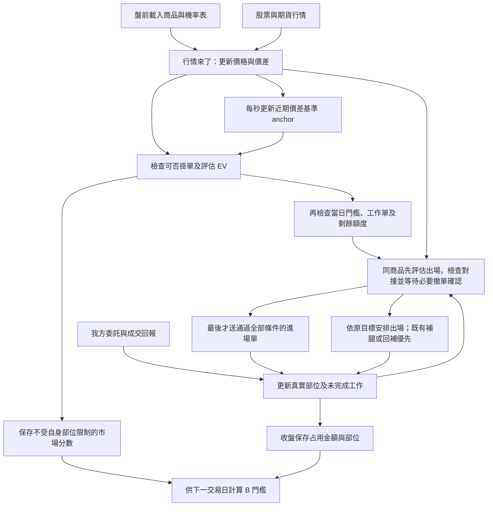

# spreadArb 交易規格：給第一次接觸本策略的 RD

版本：2026-09-30，RD 執行規則修訂。評分策略：**絕對價差回零、Q表與結算方案共同評估進場，由最高分合格方案決定出場方式，使用B動態門檻**。

本版新增期貨退檔撤單、四路出場優先與防自我成交、緩撮封鎖、交易時段及結算日風險出場。這些是使用者指定的 RD 實作規格；目前研究程式尚未完整實作，既有績效不能當成這整組新規則的回測結果。第4節區分本版時段與已完成的09:01實驗。

Q表方案本身就能讓進場通過，不需要先通過絕對價差回零方案。先前簡稱「回零篩選＋max-Q」只描述absolute路線保留回零評分、實際用Q目標出場的特殊規則，不能當成全部交易只用回零判斷進場。

本文件從交易目的開始，逐步說明盤前讀什麼、盤中算什麼、何時掛單、成交後做什麼。RD 不需要讀過前面的研究討論。英文名稱會保留，方便對照程式，但第一次出現時會解釋意思。

閱讀順序：第 1～4 節先理解策略和時段；第 5～8 節理解訊號與評分；第 9～12 節理解訂單、部位和帳；第 13～15 節供實作與驗收。盤前檔的逐欄格式另見 [13_RD_PREMARKET_HANDOFF.md](13_RD_PREMARKET_HANDOFF.md)。

評分與帳務基礎依研究程式及 [CURRENT](CURRENT.md) 整理，結構參考 [deploye_doc.md](../deploye_doc.md)。RD 的新增執行規則以本文為準；引用研究程式是供核對既有算法，不表示新規則已寫入程式。實單回報、正式盤前產檔及到期交割介面仍須 RD 接上。舊 [10_PREMARKET](10_PREMARKET.md)、[11_TRADING](11_TRADING.md) 保留歷史用途，不作本版實作依據。本文例子若標「教學假設」，數字只用來說明算法，不是歷史績效。

## 1. 這個策略到底買賣什麼

### 1.1 我們交易的是期貨與股票之間的價差

同一家公司，股票和個股期貨會有兩個價格。期貨比股票貴時，我們想做：**買股票、賣期貨，等兩個價格的差距縮小，再賣股票、買回期貨。**

一組完整部位是現貨多 2,000 股，加上同標的標準個股期貨空 1 口。這兩筆交易稱為「兩腿」。此處的「一組」不等於一張股票；一般一張股票是 1,000 股，所以一組含兩張股票。

教學例子，先忽略成本：

| 動作 | 股票 | 期貨 |
|---|---|---|
| 進場 | 100 元買 2,000 股 | 102 元賣 1 口，合約對應 2,000 股 |
| 出場 | 100 元賣掉 2,000 股 | 101 元買回 1 口 |
| 損益 | 0 元 | `(102−101)×2,000=2,000 元` |

我們賺的是這次差距縮小的收益；還要再扣交易費用。真實情況兩邊價格都可能變，必須各自記錄實際成交，不能只拿訊號價差乘本金當最後損益。

### 1.2 名詞先對齊

| 文件／程式名稱 | 白話意思 |
|---|---|
| basis，價差 | 期貨相對股票貴多少，以比例表示；`10,000×(期貨價/股票價−1)` |
| bp | 萬分之一。100 bp=1%；20 萬元的 1 bp 是 20 元 |
| B1／A1 | 市場最高買價／最低賣價；B2、A2是下一檔買／賣價 |
| 五檔、book | 目前看得到的買賣委託價量，交易程式須一直更新的行情狀態 |
| tick | 這個價格區間允許的最小跳動單位，不是行情訊息筆數 |
| maker，被動掛單 | 先把限價單掛在市場，等別人來成交 |
| taker，主動成交 | 主動買市場賣價、或賣市場買價，取得另一腿 |
| hedge，補齊另一腿 | 第一腿成交後，補上另一腿，形成或關閉完整價差部位 |
| rollback，反向補回 | 交易只做一半或多做一腿時，用反向交易把多出的曝險補回 |
| anchor，近期價差基準 | 根據當天已收到行情持續更新的平滑價差；不是一個股票價格 |
| residual，偏離基準的價差 | 當下中價算出的 basis 減 anchor |
| scale，歷史波動單位 | 盤前算好的一個 bp 數值，用來把不同商品的 residual 換成可比較的刻度 |
| Q 表 | 歷史上從某種價差狀態出發，到達某目標的機率表；不是我方委託成交保證 |
| EV | 把不同結果的淨收益依機率加權，得到的預估收益，單位 bp |
| T | 模型估計資金會占用幾個日曆日，包含夜間與週末 |
| score | `EV/T`，預估每占用一天資金能得到多少 bp，用來排序方案 |
| hurdle，進場門檻 | score 至少要達到這個數字，才考慮送單 |
| target_bp，出場目標 | 這筆部位的出場價差條件；不是要直接送給券商的限價 |
| committed，已占用金額 | 策略內尚未完全結束交易的現貨名目金額，不是期貨保證金 |

### 1.3 四種送單方式，只有一種持倉方向

| 名稱 | 先掛哪一腿 | 第一腿完整成交後補哪一腿 | 做完的結果 |
|---|---|---|---|
| S1 進場 | 掛股票買單 | 賣期貨 | 股票多 2,000 股＋期貨空 1 口 |
| S2 進場 | 掛期貨賣單 | 買股票 | 同上 |
| E1 出場 | 掛股票賣單 | 買回期貨 | 關閉原價差部位 |
| E2 出場 | 掛期貨買單 | 賣股票 | 同上 |

同商品 S1、S2、E1、E2 各最多一張工作單；是否能並存，還要通過第9.7節的防對撞條件，不能理解成四路無條件同時掛。「工作單」包括已送尚未確認、已生效、送撤尚未確定完成及狀態不明的單。

**已持有的部位可以有多筆，沒有筆數上限。** 例如已經有三組完整部位，只要金額額度允許、進場路線沒有未完成工作，仍可開第四組。工作單數量與持有部位數量是兩個不同限制。

### 1.4 進場不是只看absolute；Q表也能獨立讓進場成立

對同商品、同一時刻、同一S1或S2掛價候選，程式一起評估以下三類方案：

| 方案 | 用什麼理由判斷值得進場 | 它勝出時怎麼出場 |
|---|---|---|
| Q表，程式名residual | 看相對近期基準的價差狀態，估計回到某個Q目標的收益與時間 | 使用該Q方案的目標 |
| 絕對價差回零，程式名absolute | 估計期現價差回到0的收益與時間 | 保留回零進場分數，實際目標採`max(0,最佳Q目標)`；沒有Q目標用0 |
| 留到結算，程式名settle | 估計持有至到期的收益與時間 | 不安排一般目標出場，留到到期或風險出場 |

「任一方案符合都可以做」在**進場資格**上是對的：只要其中一個有效方案的EV≥0、T>0、score達今日hurdle，這個候選就通過評分；之後還要檢查Gate、工作單和容量。不需要absolute與Q同時達標，也不是absolute先通過後才准查Q。

若多個方案同時符合，程式挑最高score的一個，記下它的route和出場方式。**同一候選只產生一次送單，不會因absolute與Q同時合格就各開一筆。** S1、S2則是兩個獨立的執行路線，各自可以有一張工作單。

以下只演示方案選擇，假設今日hurdle=6、各方案T>0且其他送單條件都通過；數字是score，不是未扣成本的原始價差：

| absolute分數 | 最佳Q分數 | settle分數 | 進場評分結果 |
|---:|---:|---:|---|
| 4 | 9 | 3 | 通過，選Q，按該Q目標出場；absolute不過不影響它 |
| 9 | 4 | 3 | 通過，選absolute，按absolute的max-Q規則決定目標 |
| 8 | 10 | 3 | 通過，選Q；只產生一次送單，不各送一張 |
| 4 | 5 | 3 | 不通過，最高分仍低於6 |
| 4 | 5 | 9 | 通過，選settle，沒有一般maker出場目標 |

原09:05研究基準也有Q方案進場：B的6,162筆完成進場配對，absolute有5,599筆、residual有264筆、settle有299筆。這是同一候選被選中方案的分類，不是三個各自獨立下單的投組。核對見 [paired_routes.json](../data/rd_handoff_20260929/route_scope_clarification/paired_routes.json)。

## 2. 哪些東西盤前提供，哪些盤中才知道

### 2.1 三種外部輸入，一份內部狀態

| 來源 | 內容 | RD 要做什麼 |
|---|---|---|
| 盤前檔 | 今日商品和合約、參考價、scale、Q 表、成本設定、當日 hurdle | 開盤前載入並檢查日期、版本、完整性 |
| 即時行情 | 股票與期貨的五檔、Best 價量、成交、接收時間、序號、正式盤／試撮／緩撮狀態 | 持續更新行情；緩撮時撤該商品雙市場掛單並封鎖新單 |
| 委託／成交回報 | 哪張單已受理、拒絕、撤掉、成交多少股／口、成交價格 | 用來更新我方訂單、現金、部位和占用金額 |
| 策略自身狀態 | 每筆部位的原合約與原目標、工作單、還沒做完的補腿／回補 | 持續保存，隔日或程序重啟時接回 |

**看到市場有人以某價成交，不代表我方單也成交。** 實盤要用券商／交易所給我方的成交回報入帳。回測才用公共成交與排隊模型推估我方能否成交。

### 2.2 一整天的資料怎麼流



盤前不會提供「今天幾點一定成交」或「今天整條 anchor」。這些只能隨當天行情與回報逐步知道。研究點位表的未來成交欄位，例如 `t_fill_ns`，不能拿來作實盤決策。

## 3. 日期、價量單位與資料身份

這些是 RD 對接時最容易出現倍數或時差錯誤的地方。

| 項目 | 實作規則 | 例子 |
|---|---|---|
| 交易時鐘 | 文件時間是台北時間；內部接收時間用 UTC 奈秒整數 | 台北 09:00 對應 UTC 01:00 |
| 跨市場順序 | 看接收時間，不比較股票與期貨各自的 ChannelSeq 大小 | 兩市場的序號不是同一條流水號 |
| 價格儲存 | 整數代表元×10,000；期貨原始值先用 DecimalLocator 還原 | 50 元存 500000 |
| 股票數量 | 內部用股；歷史檔 Lots 一張要乘 1,000 | 2 Lots=2,000 股 |
| 期貨數量 | 內部用口；損益乘該合約股數 | 1 口標準合約對應 2,000 股 |
| 容量金額 | 內部用整數分，價格乘股數後向上取到分 | `ceil(price_i×shares/100)` |
| 合約身份 | 股票代碼之外，還要保存完整期貨合約代碼與到期日 | 不能只記「某股票期貨」而不記月份 |

研究使用的 tick 表：價格低於 10／50／100／500／1,000 元時，分別為 0.01／0.05／0.1／0.5／1 元；其餘為 5 元。跨級距要沿合法價位移動：50.00 的前一 tick 是 49.95，不是 49.90。

實作函式為 `previous_tick(P)=P−tick(P−最小價格單位)`、`next_tick(P)=P+tick(P)`。正式上線仍需與商品主檔的 tick 和合約乘數對接；調整型合約不能默認永遠是 2,000 股。

## 4. 什麼時間可以進場、出場

### 4.1 本版一般交易日的時間表

下列是2026-09-30指定給RD的新規則。時段控制的是**新增委託**，不是宣告原單撤掉或部位平倉；成交、撤單回報與未完成曝險必須持續處理。

| 台北時間 | 執行規則 |
|---|---|
| 開盤前 | 載入盤前檔、辨識結算日模式，恢復原合約部位、工作單與未完成任務 |
| 09:00:00起 | 累積當時可見行情、更新anchor；一般S1／S2／E1／E2尚不新增 |
| **09:01:00起** | 允許新增S1、S2、E1、E2；各路仍須通過目標／EV、Gate、防對撞、容量及行情狀態檢查 |
| **12:53:00起** | **不再新增S1／S2，包含撤單後重掛。** 既有進場單留到自身撤單條件觸發或成交，不在這一秒全撤 |
| **13:20:00起** | **不再新增E1／E2，包含撤單後重掛。** 既有出場單仍受撤單條件管理，等成交、條件撤單或全市場撤單 |
| **13:24:55全市場撤單** | 對本策略所有商品、兩市場尚未終結的掛單送撤，包含仍有效的結算risk委託；同時停止risk計時器新增／重試，記錄未確認及撤單拒絕 |
| 全撤之後 | 不再新增四路一般maker或追加結算現貨risk排程單；繼續處理回報與既有曝險，不能因全撤就把部位或任務清零。未完成risk保留剩量，見第11.3節 |

明確邊界：09:01:00可以評估新單；12:53:00起S1／S2不能新送；13:20:00起E1／E2不能新送。等待撤單確認、排程重試及其他執行緒最後送單前，都要再檢查現在是否已超過截止時間。

「全市場」指本策略所管理的全部現貨／期貨商品工作單，不是只撤當前收到行情的那一檔，也不是任意刪除帳戶中其他策略的委託。

### 4.2 停止新增，和刪掉舊單，是兩件事

**例一：12:52:59.900送S2。** 到12:53:00不新增S1／S2，但這張S2不因截止就被刪除；它仍可能在12:53:25成交，也可能先因退到期貨第二檔、Gate失效或60秒到期而送撤。撤掉後不能再重掛S2。

**例二：13:19:59已掛E2。** 到13:20:00後不再新增E1／E2，原E2仍按退檔、Gate、目標及60秒條件管理；撤完不能再新增另一張E2。全撤時間到則對剩餘工作單送撤。

**例三：已送撤，卻先收到成交。** 必須先記錄真實成交，再根據剩餘曝險處理補腿／回補。送撤要求不等於撤單已完成，不能用固定50ms取代實單確認。

### 4.3 隔夜、緩撮與既有曝險

一般交易日未完成出場的正常未到期部位可以隔夜。隔天繼續用原合約與原出場目標，不自動換月，也不改成新anchor。

新增S1／S2、E1／E2的截止，不是停止處理既有曝險的理由；但遇到緩撮時，第9.8節的該商品新單封鎖同樣適用補腿／回補，不擅自繞過。恢復交易後先核對回報與舊任務。

### 4.4 哪些時間規則已測過，哪些是這次新增

| 版本 | 起始／停止新進場／出場與全撤 | 證據範圍 |
|---|---|---|
| 既有研究基準B | 09:05／12:53:20；一般出場須於13:18前生效，13:18全撤，13:20研究事件窗口結束 | 131日淨利3,304,834.12元、年化31.5347% |
| 09:01對照實驗B | 只把進場與一般出場開始提前至09:01；其餘仍沿用基準 | 131日淨利3,389,424.90元、年化32.3418%；成交、資金與EV核對通過 |
| 本版RD執行規格 | 第4.1節新時段，加上退檔撤單、防對撞、緩撮及結算日流程 | 尚未實作並重跑整組新規則；不能直接套用上列績效 |

09:01實驗的完整結果見 [comparison.json](../data/backtest/open0901_20260929/comparison.json)。它沿用原本Q與成本表，沒有同時改成12:53:00截止、13:20停止新增出場或本版結算流程。

anchor從09:00的第一個有效觀測就有值，不需等滿五分鐘。現有Q歷史決策樣本仍取`[300,14000)`秒、每30秒一筆；本版交易許可與歷史取樣範圍要分開。第7節保留的13:20時間近似及basis=0結算分支是舊模型算法，**不代表新的到期現貨分批賣出必然取得同樣價格或時間**。模型取樣／成本與新執行時段的重新校準另行驗證，不能悄悄換表或改教學數字。

### 4.5 結算日切換到專用流程

- **只有當天到期的期貨合約，全天禁止新增S1／S2，包含重掛。** 按精確合約的`trade_date == expiry`判斷；其他到期日的合約不因這項規則被封鎖，仍須通過原有進場資格。
- 今日到期合約的E1／E2仍依原目標管理，從09:01可掛到**13:00前**；13:00停止新增並全撤該到期部位相關工作單。
- 撤單與在途成交核清後，剩餘期貨留待正式結算，現貨改走第11.3節的分批taker賣出；這不是一般E1／E2重掛。
- 結算流程以精確到期合約辨識；非到期合約不能被當作已結算或直接清零。
- **13:24:55全撤也適用結算risk。** 秒間隔為`1,500/N`，但到全撤時間就停止追加排程單；剩量明列未完成risk，不在全撤後再送。

目前交易清單只使用近月個股期貨，這批合約的到期日相同，所以該日實際上整批都不能新增S1／S2。這是目前交易清單的結果；RD仍逐合約檢查到期日，不把規則硬寫成某個日期全策略停開倉。未來納入不同到期日的合約時，就能按各自到期日處理。

## 5. 每秒到底要算什麼：價差、anchor、residual、scale

### 5.1 「建立秒格」就是每整秒記一筆當時已知狀態

它不是把未來一秒的成交平均後，放回現在使用。

例如10:00:00整點，股票最後一份已收到報價來自09:59:59.980，期貨來自09:59:59.995。這兩份就是該秒的輸入。如果新的期貨報價10:00:00.200才到，不能拿它重寫10:00:00那筆秒格。

| 秒格時間 | 此秒能使用的資料 | 結果何時使用 |
|---|---|---|
| 10:00:00.000 | 接收時間≤10:00:00.000的最後狀態 | 供本秒的anchor／residual使用 |
| 10:00:01.000 | 接收時間≤10:00:01.000的最後狀態 | 計算下一秒的新anchor／residual |

盤中逐筆掛價仍用最新行情。例如10:00:00.200做決策，掛價用.200當時已知book，anchor／residual仍使用10:00:00那筆整秒結果。兩個更新頻率不同。

### 5.2 先算目前期貨比股票貴多少

用買賣中價描述市場價差：`中價=(買一價+賣一價)/2`。

```text
股票中價 = 100.00 元
期貨中價 = 101.20 元
basis_mid = 10,000 × (101.20/100.00−1) = 120 bp
```

這個120 bp描述市場狀態。真正掛單與補另一腿，不一定能用這兩個中價成交，所以第6節還會另外算「按本次掛價能取得的價差」`quote_ab`。

研究秒格的中價來源是既有landmark的L1欄位；其中期貨的可執行Best價另算。RD重建時要保持同一來源，不能把所有模型中價都改成Best合併後的價格。

### 5.3 anchor 是把每秒價差平滑後得到的「近期基準」

假設價差剛才一直在100 bp附近，突然跳到120 bp。若每次都直接把最新價差當基準，基準會跟著跳，無法描述「現在比近期偏高多少」。anchor每次只向新值移動一小段。

目前使用EWMA，也就是越新的觀測權重越高的移動平均。更新公式：

```text
alpha = 1−0.5^(1/120) ≈ 0.005759576
新anchor = 舊anchor + alpha × (本秒basis_mid−舊anchor)
```

例：舊anchor=100，本秒basis_mid=120：

```text
新anchor = 100 + 0.005759576 × 20
          = 100.115192 bp
```

它不會立刻變成120。若之後每秒都是120、且連續有效，約120次有效更新後，原先20 bp的差距會縮到約10 bp。「半衰120秒」在這份實作是120個有效秒觀測的權重效果，不是只看最近120秒、也不是等滿120秒才有值。

第一個有效觀測直接作為初始anchor；從09:00的有效觀測開始更新，本版從09:01開放一般掛單，當下仍須有有效輸入。每天重新起算，不能拿昨日最後anchor當今日初值。

### 5.4 無效行情那一秒怎麼辦

先檢查是不是正式盤、價量是否有效、是否在允許的參考價範圍。無效時，該秒輸出null，代表本秒沒有可供決策的anchor；內部舊的累積值保留，下一次有效觀測再接著更新。

例如輸入為`100、null、120`，輸出為`100、null、100.115192`。不能把中間的null填成100，然後照常開倉。

供RD精確對照的規則：

- 秒格用`RecvTime<=整秒時間`，資料只往後取得，不能讀下一秒。
- `eligible_base`是該秒基礎有效性：正式盤、兩腿L1與期貨可執行book價量有效、價格嚴格落在各自參考價0.91～1.08倍內。秒格可接受買賣同價，送單時另要求`B1<A1`。
- `basis_eval = eligible_base ? basis_mid : null`。EWMA對應`ewm_mean(half_life=120, adjust=False, ignore_nulls=True)`。
- 現有歷史資料的`analysis_eligible`再加上「09:05以後」，供歷史取樣使用，不代表anchor也等到09:05才起算。RD的09:01交易許可不能直接套這個歷史取樣旗標；應用當時行情、anchor與本版時段／Gate判斷。
- 目前未啟用「60秒沒有新book就失效」規則。實盤斷線風控要另外接，不能把它說成現行回測已經做了。

來源：[landmarks](../../maker/src/common/landmarks.py)、[anchors](../../maker/src/fair_mid/anchors.py)、[秒格讀取](../src/common/grid.py)。

### 5.5 residual 與 scale 是用來描述「偏高了幾格」

`residual=當秒basis_mid−anchor`。它是相對近期基準的偏離，不是期現價差本身。

scale由盤前歷史資料提供，今天固定。例如scale=20 bp，表示我們把20 bp當作該商品的一個波動單位。若basis_mid=140、anchor=100，則residual=40，`e=residual/scale=2`，意思是比基準高2個單位。

Q表以這個e、當天時間及離到期多久，找相似歷史狀態。**e用中價的residual，不能拿`quote_ab−anchor`替代。** 候選掛價可能比中價更好，因此兩者原本就可能不同。

## 6. 什麼行情下可以考慮掛單

### 6.1 先維護最新的買賣價量

五檔取有量的價位。若BestBid／BestAsk比五檔更好，就納入可執行價格；同價量取較大者，不把重複顯示的量加總。正式送單要求買一與賣一都有量、價格有效，且`B1<A1`。

期貨純成交訊息可能五檔全零，這類訊息不會把上一份book清掉；但明確的清空或試撮狀態更新必須處理，不能把所有零值一律忽略。

### 6.2 四路掛在哪裡

| 路線 | 掛單價格P | 拿哪個對向價估計完成兩腿後的basis |
|---|---|---|
| S1 | 股票B1買2,000股 | `10,000×(期貨B1/P−1)` |
| S2 | 期貨A1的前一個合法tick賣1口 | `10,000×(P/股票A1−1)` |
| E1 | 股票A1賣2,000股 | `10,000×(期貨A1/P−1)` |
| E2 | 期貨B1的下一個合法tick買1口 | `10,000×(P/股票B1−1)` |

S2的P必須仍高於期貨B1；E2的P必須仍低於期貨A1。若期貨盤口只差一tick，往內移一tick就會碰到對手價，這兩路當下不能掛。

每張單送達市場時還要確認是被動掛單。研究假設市場可以拒絕已變成會立即吃單的委託（post-only）；實盤RD要確認下單介面有沒有這項能力。

### 6.3 Gate 就是送單前與掛單期間都要檢查的條件

| 路線 | 條件 | 白話解釋 |
|---|---|---|
| S1 | 期貨買一至下一有量買價≤1tick；現貨`BidLots1/(BidLots1+AskLots1)<0.3` | 補期貨賣單的價位不能斷得太遠；股票原始買一量占比不能太高 |
| S2 | 現貨賣一至下一有量賣價≤1tick；`AskLots1/sum(AskLots1..5)<0.2`；現貨A1≥10,000股 | 補股票買單要有深度，且原始賣一不能占五檔賣量太大比例 |
| E1 | 期貨賣一至下一有量賣價≤1tick | 出場補買期貨的相鄰價位不能斷太遠 |
| E2 | 現貨買一至下一有量買價≤1tick | 出場補賣股票的相鄰價位不能斷太遠 |

例如現貨原始買一2,000股、賣一8,000股，S1比例=0.2，可通過0.3限制。S2若A1=12,000股、原始五檔賣量總計80,000股，比例0.15且A1足量；其他條件也通過才可以掛。

找不到第二個有量價位，gap條件不通過。bid gap的tick按第二價計算，ask gap按第一價計算。兩個形狀比例用原始五檔；A1至少10,000股則用合併Best後的量。買一加賣一為零時第一個比例取0.5；五檔賣量為零時第二個比例無效。

### 6.4 進場還要通過哪些條件

1. 在第4節允許新進場的時段，兩腿正式行情有效，bid／ask嚴格落在參考價0.91～1.08倍內。
2. anchor存在且≥0；候選掛價取得的`quote_ab>0`。
3. `quote_ab−anchor≥25 bp`，或`quote_ab≥50 bp`，兩者至少一項成立。
4. `scale_raw>60 bp`時整個商品不開新倉。scale缺失或小於1造成scale無效時，只停用residual評估，仍可評absolute或settle。
5. 第7節評分通過後，還要通過B門檻、該路線工作單限制、即時金額限制與第9.7節出場優先檢查；緩撮及結算日禁開倉規則先於EV資格。

公司行動另由現行公告快取擋新進場：`announce_day<D<=effective_day`的商品進入阻擋集合；已配對的隔夜部位當日開始安排風險出場。這不是固定「除息前三天」。正式停牌、處置、合約調整資料仍需接入。

### 6.5 不是每來一筆行情都送新單

行情變化先觸發「重新評估」，不是保證送單。現行市場候選觸發有：

| 觸發 | 精確對照 |
|---|---|
| 開始合格、掛價改變、由不合格變合格 | 當下仍須符合前述進場條件 |
| 整秒時偏離程度跨桶 | `quote_ab−anchor`對`(0,5,10,15,20,25,30)`作searchsorted left |
| S1排在前面的買量明顯改變 | `floor(log(max(B1股數/1000,1))/log(1.10))`桶改變 |
| S2補股票條件或期貨買賣價改變 | SpotA1、SpotA1量、FutB1、FutA1任一改變 |
| maker那個商品出現可及候選價的成交 | S1成交價≤掛價；S2成交價≥掛價 |

另外，每張工作單滿60秒會獨立觸發撤單與重新評估，第9節說明。它不是上表的普通市場候選，不能混入第8節B的分數統計。

## 7. EV評估：用一個完整例子從頭算到出場目標

### 7.1 先分開兩個問題

**第一個問題：這次進場值不值得占用資金？** Q表、絕對價差回零、結算方案都可提供進場理由。用各有效方案的EV與預估持有時間T算score，從EV≥0、T>0者挑最高分，再和進場門檻比。Q最高且過門檻就能進場，即使absolute沒有格子或未達門檻也可以。

**第二個問題：進場後，價差降到哪裡才開始掛出場？** 用勝出方案決定target。Q方案勝出就用它的Q目標，settle勝出則等結算。只有absolute勝出時，才套用「回零估計分數篩選、實際目標用max-Q」這條特殊規則。

因此有三種評估想法，最多共六個候選方案：

| 程式route名稱 | 評估的想法 | 候選數 |
|---|---|---:|
| residual | 回到近期anchor附近的某個水位 | 4個x水位 |
| settle | 一直留到到期結算 | 1 |
| absolute | 等期現可執行價差回到0 | 1 |

route是「怎麼評估價差」，不是S1／S2哪腿先掛，也不是E1／E2哪腿先出。這三組名稱不能混用。以下完整算例刻意演示absolute勝出的情況，不表示其他交易也必須靠absolute進場；Q單獨合格等情境已列在第1.4節。

### 7.2 教學例子的已知條件

以下機率是為說明算式而設的假資料，所有結果已用目前EV函式重算；不代表任何商品真實機率。

| 輸入 | 本例數字 | 意思 |
|---|---:|---|
| 決策日與時間 | 2026/6/15 11:20 | 還在允許新進場時段 |
| 合約到期 | 2026/6/17 | 還有明天、後天兩個預告交易日 |
| S2候選`quote_ab` | 150 bp | 按這次掛價與當前補股票價估計的進場價差 |
| `anchor` | 100 bp | 近期平滑價差基準 |
| `scale` | 20 bp | 一個歷史波動單位 |
| 當秒中價basis／e | 140 bp／2 | `(140−100)/20=2`，用來查Q表 |
| 進場預估衰減`d_in` | 11.9 bp | S2基礎8.9加3bp保守餘量；本例半tick下限10bp較小 |
| 一般出場／結算衰減 | 各3 bp | 預估成交比理想價差差多少 |
| 整組交易費用 | 同日20／跨日34 bp | 預估兩腿完整進出成本 |

「衰減」是送單到實際做完兩腿期間可能少拿到的價差。它和費稅不同；算EV會先扣它，但最後實際損益已用真實成交價，不能再扣第二次。

### 7.3 四個Q目標從哪裡來

Q表評估`x=0、−0.25、−0.5、−1`，每個x都轉成真正的basis目標：

```text
目標basis = anchor + x × scale
```

| x | 代入100與20 | 目標 |
|---|---|---:|
| 0 | 100+0×20 | 100 bp |
| −0.25 | 100−0.25×20 | 95 bp |
| −0.5 | 100−0.5×20 | 90 bp |
| −1 | 100−1×20 | 80 bp |

特別注意：**x=0是「回到anchor」，此例為100 bp，不是期現價差回到0 bp。** 真正回零是absolute方案。

### 7.4 先手算「目標90 bp」這個方案

假設查表得到`C0=0.5、C1=0.8、q=0.5`。三個值的意思不同：

- C0：歷史相似狀態中，當天到達目標的比例50%。
- C1：到下一交易日為止，累計已到達的比例80%；不是「明天單日80%」。
- q：前兩個交易日都還沒到達的樣本，之後每個交易日到達的估計機率50%。

於是四種互斥結果是：

| 結果 | 算法 | 機率 |
|---|---|---:|
| 今天到90 | C0 | 50% |
| 今天沒到、明天到90 | C1−C0 | 30% |
| 前兩天沒到、後天到90 | `(1−C1)×q` | 10% |
| 到期前仍未自然到90，走結算 | `(1−C1)×(1−q)` | 10% |

這是市場目標到達統計，EV把它當作出場分支近似；不是說我方有50%機率今天一定完成maker成交。

每種結果能拿多少？

| 結果 | 扣成本的算式 | 預估淨收益 |
|---|---|---:|
| 今天以90目標出場 | `150−11.9−90−3−20` | 25.1 bp |
| 明天或後天以90目標出場 | `150−11.9−90−3−34` | 11.1 bp |
| 未自然出場，到期按basis=0結算 | `150−11.9−0−3−34` | 101.1 bp |

結算分支少扣了90 bp，因此本例收益較高，但要等到到期，且依賴basis=0結算假設。它不是已拿到的保證收益，也不能從平均中刪掉這個分支。

把機率乘收益再相加：

```text
EV = 50%×25.1 + 30%×11.1 + 10%×11.1 + 10%×101.1
   = 27.1 bp
```

若拿20萬元作比例示意，27.1 bp對應542元的模型預估收益；這不是一筆已實現交易損益。

### 7.5 同一例子的持有時間T怎麼算

從11:20到研究窗口終點13:20還有2小時，換成日曆日是`2/24=0.083333`。模型以各可能結束日的窗口終點作時間近似；不是預言今天那筆單一定13:20才成交。

| 結果 | 模型使用的時間 |
|---|---:|
| 今天出場 | 0.083333日 |
| 明天出場 | 1.083333日 |
| 後天出場 | 2.083333日 |
| 到期結算 | 2.083333日 |

```text
T = 50%×0.083333 + 30%×1.083333
    + 10%×2.083333 + 10%×2.083333
  = 0.783333 日
score = EV/T = 27.1/0.783333 = 34.595745 bp／日曆日
```

若中間跨週末，不能只加1個交易日：假設從週五到下週一，那一分支要加3個日曆日。為此盤前檔要提供預告交易日對應的日曆日差。

### 7.6 把其餘三個Q目標也算完

本例假設以下三個查表值；仍按剛才同一套算法計算。

| 目標 | C0 | C1 | q | EV（bp） | T（日曆日） | score |
|---|---:|---:|---:|---:|---:|---:|
| 100 | 0.70 | 0.90 | 0.50 | 15.900 | 0.483333 | 32.896552 |
| 95 | 0.60 | 0.85 | 0.50 | 21.625 | 0.633333 | 34.144737 |
| **90** | **0.50** | **0.80** | **0.50** | **27.100** | **0.783333** | **34.595745** |
| 80 | 0.10 | 0.80 | 0.50 | 30.500 | 1.183333 | 25.774648 |

Q方案中選90 bp，因為它的score最高。80 bp雖然單次預估收益更大，卻等得更久，除以占用時間後反而較差。

所以**max-Q指「最高EV/T所對應的Q方案」，不是最高basis，也不是最低basis**。它也不是強化學習的Q值最大化；這裡的Q只是本策略歷史表的名稱。

### 7.7 回零與結算兩個方案怎麼加入比較

**回零方案absolute：** 用`150−11.9=138.1 bp`查絕對回零表。138.1距150門檻比100近，因此用150門檻的樣本格。

假設這張表給「今天回零10%、明天30%、後天30%、留到結算30%」。它是另一張表，不直接複製剛才90 bp目標的機率。

```text
今天回零淨收益 = 150−11.9−3−20 = 115.1 bp
其餘本例分支淨收益 = 150−11.9−3−34 = 101.1 bp
EV = 10%×115.1 + 90%×101.1 = 102.5 bp
T = 10%×0.083333 + 30%×1.083333
    + 30%×2.083333 + 30%×2.083333
  = 1.583333 日
score = 64.736842
```

**直接等結算方案settle：** 不賭哪一天先碰到目標，直接估計留到到期：EV=101.1 bp、T=2.083333日、score=48.528。

六個方案一起比較，最高者是回零方案64.736842。基礎進場門檻是5.8219178，所以這次評分通過；若今日B抬到70，則仍不進場。評分通過後還得檢查掛單及容量，不是直接認列部位。

### 7.8 通過後到底存0，還是存90作出場目標

**這個例子存90 bp。** 原因是目前採用規則：absolute勝出時，進場資格保留回零分數，實際目標取`max(0,最佳Q目標)`。本例最佳Q目標90，所以取90。

| 最終勝出的評估方案 | 寫進這筆部位的目標 |
|---|---|
| residual | 直接存該Q方案的目標，可以為負值 |
| absolute | 存`max(0,最佳Q目標)`；沒有可用Q方案時存0 |
| settle | 存null，代表不安排一般E1／E2目標出場，留到到期或風險出場 |

因此本例不能同時宣稱「實際等90出場」及「預期可賺102.5 bp」。102.5是回零screen的估值；90方案自己的估值是27.1。這是已選定的篩選政策，RD要保留兩者的意義，不能把回零EV標成max-Q實際出場的預估淨利。

程式還有一個細節：absolute挑最佳Q目標時，從所有T>0的residual評估挑最高score，沒有再要求該residual的EV≥0。`max_q_pos`才有那項限制，本版沒有啟用。

目標在進場送單決策時寫入，這筆單成交後沿用它。隔日換表、anchor改變、出場單撤掉重掛，都不改它；未成交進場單撤掉後重新決策，才算新的進場方案。

實際歷史例子另見 [EV與期末評估](10_EV_AND_EVALUATION_20260929.md)：回零分數29.1082通過，實際目標77.6233 bp。那是歷史例子，與本節教學數字分開。

### 7.9 RD要保留的精確邊界

- 基礎成本：S1進場25.7、S2進場8.9，再加3bp；`d_in=max(max(base,0)+3,execution_floor)`。S2的floor至少為股票A1半tick的bp，取較大者，不重複相加。
- 殘差表C0缺格，該x不評；C1缺格當C0；q缺格當0。C1限制在C0～1，q限制在0～1。
- 回零表用`quote_ab−d_in`；低於50bp沒有absolute路線；50／100／150／200挑最近者，等距挑較小者。
- absolute的`p_day`需完整第0～15日；超出合約剩餘交易日的機率轉入結算。15日後自然收斂機率若還有可用交易日，時間用那些日曆偏移的平均，否則也轉結算。
- 選進場方案先保留EV≥0且T>0者，再挑最高score；score等於hurdle可過。同分保留順序：四個residual的x=0、−0.25、−0.5、−1，接settle，最後absolute。
- 研究公式在到期當日`K=0`，結算時間只算今日剩餘時間，結算分支費用用20bp。這是模型邊界對照，不是允許結算日開倉；本版送單另受第4.5節禁止S1／S2限制。

一般化算式中，令`r=(15600−quote_second)/86400`、`k=到期日−今日`、`off[j]=第j個未來交易日的日曆日差`：

```text
K=0：P_sd=C0，P_never=1−C0
K>=1：P_sd=C0，P_1=C1−C0
       P_j=(1−C1)×(1−q)^(j−2)×q，j=2..K
       P_never=(1−C1)×(1−q)^(K−1)
P_on=sum(P_j)
B_x=anchor+x×scale
G_target=quote_ab−d_in−B_x−d_out
F_expiry=20（k=0）或34（k>0）
EV=P_sd×(G_target−20)+P_on×(G_target−34)
   +P_never×(quote_ab−d_in−d_settle−F_expiry)
T=P_sd×r+sum(P_j×(off[j]+r))+P_never×(k+r)
```

## 8. B動態門檻：昨日資金用得多，今天挑得更嚴

A每天固定用基礎門檻；B則看前一交易日實際收盤占用。目的在資金比較吃緊後，提高隔日進場分數要求。

```text
基礎hurdle = 8.5 bp／交易日 × 250/365
           = 5.821917808219178 bp／日曆日
若昨日收盤占用 >= 1,600萬元，且昨日市場分數非空：
    今日hurdle = max(基礎hurdle, 昨日市場分數中位數)
否則使用基礎hurdle
```

例：昨日收盤占1,700萬元，合格市場分數是6、8、10、12，中位數=(8+10)/2=9，因此今日門檻9。若昨日只占1,500萬元，就仍用5.8219178。今天一開盤決定後整日固定，不因盤中突然滿倉而即刻跳門檻。

「昨日市場分數」要代表市場曾提供哪些機會，不是我們最後做了哪些交易。所以即使滿倉沒下單，也要照算普通市場候選；只保留通過基礎門檻的獨立分數，不能只取成交分數、或只取超過昨日已提高門檻者。部位造成的60秒重掛評分不放進這個母體。

精確蒐集位置是在B當日門檻、工作單、部位、容量及公司行動Actor篩選之前；best存在、reason為ok／hurdle、score≥base才留。偶數筆中位數按linear quantile取中間兩個平均，不另設60bp上限。

避免同一輸入反覆計入，去重鍵如下；不要四捨五入到分鐘或整數bp：

```text
vc, qc, stream, quote_ab, anchor, quote_second, expiry,
scale, scale_raw, e_norm, resid_mid_bp, tick_bp_hedge,
execution_floor_bp, spot_a1
```

RD每天要回傳實際收盤占用與上述分數統計。正常營運檔案遺失不能假裝是「首次啟動沒有資料」；真正冷啟可明確標示後使用base，其他缺檔按盤前文件處理。

## 9. 進場單送出去以後會發生什麼

### 9.1 用S2的正常流程看一次

假設10:00判斷S2可做，金額20萬元且額度足夠：

1. 送期貨賣單1口；目前還沒成交，占用金額不增加，但S2工作單位置已被使用。
2. 研究假設50ms後掛單生效，開始排隊。若送達時已會吃到買價，按post-only拒絕。
3. 收到我方期貨成交1口的回報，立即記錄期貨空單，按此時股票A1估計2,000股名目，占用立即增加。
4. 研究在成交50ms後嘗試買股票2,000股；完成後形成完整價差部位，容量改用股票實際買入成本。
5. S2這次進場工作結束，因此可再評估同商品下一張S2；剛建立的部位仍存在，交給第10節管理出場。

若第4步股票深度不足，期貨空單仍存在，金額也仍占用，不能當作進場失敗就刪掉。該路進場未完成，不能再開另一筆同路工作。

### 9.2 S1股票只成交一部分的例子

掛買2,000股、每股100元，先成交1,000股：立即記現貨多1,000股及10萬元占用。此時不能把它當作「還沒湊滿一組所以沒部位」，也不賣半口期貨。

- 若剩餘1,000股也成交：湊滿2,000股後，才安排50ms後賣期貨1口。
- 若之後觸發撤單：等撤單確定，確認剩餘沒有成交，再安排反向賣回已買的1,000股。
- 回補也可能尚未成交。完成賣回且沒有其他工作單／任務後，才把這次交易結束並退回占用。

S1、S2各自有工作單限制。每個商品每一路在quoting、entry_hedge、entry_rollback期間都不再送同路新單；跨路線另受第9.7節防對撞約束，不能只看本路有沒有單。

### 9.3 什麼狀況要撤進場單

掛單期間用**原掛價**搭配最新對向行情重算basis，不是先偷偷把限價改成最新價。

| 觸發 | 動作 |
|---|---|
| 行情或本路Gate失效 | 送撤 |
| 該原掛價的basis≤0，或basis−當前anchor<20bp | 送撤 |
| 成交後金額不足以容納此單剩量 | 送撤 |
| 自live起已滿60秒 | 送撤，結束後另作重新評估 |
| S2退到期貨第二檔或更後 | 立即送撤，判斷見第9.6節 |
| 出場需要移除衝突進場單 | 依第9.7節先撤進場單，保留出場優先權 |
| 該商品進入緩撮 | 雙市場全部工作單送撤，封鎖新單，見第9.8節 |
| 第4節全撤時間到，或結算日13:00切換 | 對適用範圍的剩餘工作單送撤，不再重掛一般maker |

進場預篩用25bp，掛單續留地板用20bp，兩個數字用途不同。S2續留期間仍要求股票A1量≥10,000股。

送撤到確定撤掉之間仍可能成交，研究延遲50ms。真實成交必須先入帳，不能因為我們已經按了撤單就當作不存在。

### 9.4 60秒更新不是每個整分鐘一起重掛

```text
09:01:00.000  決策並送單
09:01:00.050  單子生效，從這一刻開始計60秒
09:02:00.050  到60秒，送撤
09:02:00.100  假設此時確認撤單，且沒有部分成交待回補
               用此時行情、EV、B門檻、容量及防對撞規則重新決策
約09:02:00.150 新單才可能生效
```

上述50ms僅為教學延遲；實盤以回報確認。未過條件就不重掛；若已到12:53:00，進場也不再重掛。若有部分成交，先完成回補再重新判斷，不能在舊曝險尚未結束時直接當新單。

### 9.5 補另一腿時取不到量怎麼辦

研究讀當下五檔，只有足量完成整筆時才執行，否則等下一份book重試，未完任務可跨日。沒有「等5秒就自動視為成交」或「等太久就釋放金額」的規則。

實盤即使用IOC也可能部分成交，RD要根據回報逐次記錄已成量，只補剩量，保存已送未確認的單號。不能把研究的整筆深度假設當成券商會保證全成。


### 9.6 S2／E2從期貨第一檔退到第二檔，立即送撤

S2原本掛在期貨`A1`前一個合法tick，E2掛在`B1`後一個合法tick，目的是改善同側最佳價格。掛單後用**我方未成交剩量的原限價P**，和最新期貨同側最佳價比較：

| 工作單 | 退到第二檔或更後面的判斷 | 動作 |
|---|---|---|
| S2，期貨賣單 | 最新期貨`A1 < P`，市場出現比我方更低的賣價 | 立即送撤S2剩量，不等60秒，也不等EV或價差惡化 |
| E2，期貨買單 | 最新期貨`B1 > P`，市場出現比我方更高的買價 | 立即送撤E2剩量，不等60秒，也不等出場目標失效 |

這裡的「第一檔／第二檔」指**價格層級**，不是同價排隊第幾個。我方價仍等於最佳價時，不因同價有別人排前面就套退檔撤單；自己改善的報價成為市場最佳價，也不是撤單原因。若行情不含我方新單，我方比可見最佳價更好時仍可續留。

教學例子：期貨A1=63.80、tick=0.10，S2掛63.70；後來有人掛賣63.60，我方63.70就退到後一檔，送撤。E2掛買63.50後，若市場B1變63.60，也送撤；若B1仍63.50則不因本條撤單。

撤單確認前，原單仍計為工作單，不能直接用新價格再送一張。若途中成交，先入帳並處理補腿／回補；要重掛時，重新檢查時段、Gate、目標／EV、容量及防對撞規則。

### 9.7 四路防對撞：出場優先，確定舊單結束才掛新單

雖然maker第一腿可能掛在不同市場，成交後的taker補腿可能打到自己的另一張單。例如E1股票賣出後要買回期貨，不能買到自己仍掛著的S2期貨賣單。

「存在還沒刪的單」包含送單待回覆、有效剩量、送撤待確認、撤單拒絕或狀態不明。只有確認已撤、已拒絕或完全成交等終態，才能解除該張單的阻擋；完全成交另有補腿任務時，任務仍須處理。

下表是使用者指定的四個新單條件。「排在現貨A1／B1」以該張工作單的原限價，對照最新現貨A1／B1判斷，不能用送單當時的排名。

| 準備新增哪一路 | 同商品已有什麼單 | 必須做什麼 | 避免哪一腿對撞 |
|---|---|---|---|
| S1 | 尚未確定刪除的E2 | **不掛S1**，保留出場機會 | S1成交後賣期貨，可能打到E2期貨買單 |
| S2 | 尚未確定刪除、且仍排現貨A1的E1 | **不掛S2**，保留E1 | S2成交後買股票，可能打到E1股票賣單 |
| E1 | 尚未確定刪除的S2 | **先刪S2，等撤單確認，再重評是否掛E1** | E1成交後買期貨，可能打到S2期貨賣單 |
| E2 | 尚未確定刪除、且仍排現貨B1的S1 | **先刪S1，等撤單確認，再重評是否掛E2** | E2成交後賣股票，可能打到S1股票買單 |

具體執行順序：

1. E1／E2先通過本身的時段、Gate、原目標及工作單檢查，才取得這次出場送單優先權；未達目標不會無故要求刪進場單。
2. 用同商品共用的訂單狀態處理衝突；出場等待撤單時，保留阻擋原因及衝突單ID，避免另一個執行緒又補掛被刪的進場路線。
3. 對衝突進場單送撤，出場先不送。成交與撤單回報照實套用；固定等50ms不等於已收到撤單確認。
4. 衝突單確定終結後，用最新行情與部位重新檢查出場條件；仍合格才送，否則解除這次出場等待。不能把撤單前的掛價與目標達成狀態當成現在仍成立。
5. 新進場最後評估；同一批行情同時觸發進、出場時，不能讓S1／S2先搶到工作單位置。

**防對撞也要在實際補腿前再檢查。** 四個條件是maker新增單的規則，不能取代對實際taker價格範圍的檢查。補腿／回補可能吃到第二檔以後，且等待期間行情會變；只要預計成交範圍內仍有我方反向工作單，就先撤該單、確認終態並重算剩量，才送taker。也不能允許新maker直接跨價打到我方反向單；若五檔不足以證明無衝突，不以無價格限制的主動單略過檢查。

直接掛單價也不能互撞。例如S2仍掛賣期貨63.70，E2新候選想買63.70，即使是在比對另一組路線條件，也不能直接送出；先按出場優先撤S2並確認，再重評E2。S2／E2都改善一tick不保證彼此一定不會交叉。

已成交曝險的補腿／回補，優先於新增maker機會；必要時撤掉阻擋它的出場工作單。「出場優先」是在爭取**新掛單機會**時，不能讓已成交的進場腿永遠等不到補腿。此規則對同現貨代碼的共用股票腿一起檢查，期貨對撞則按精確合約代碼檢查；不只比position_id。

### 9.8 遇到緩撮：撤該商品所有掛單，期間不送新單

緩撮是行情狀態；不是「今天曾經發生過就整天禁止」，也不能只因一筆純成交訊息五檔為零就認定緩撮。

1. 任一相關腿收到正式緩撮／暫緩撮合狀態，立即先把該商品設為禁止新單，再對本策略該商品的**現貨及期貨全部工作單**送撤，包含S1、S2、E1、E2及仍有有效剩量的主動單。
2. 緩撮期間不新增這個商品的任何委託，包含重掛、補腿、rollback與結算日現貨taker；待處理任務保留。撤單、查詢及委託／成交回報處理繼續運作。
3. 撤單途中成交仍入帳、占用仍保留；不能用緩撮旗標抹去成交或宣告部位已結束。
4. 收到明確恢復正式交易的狀態、兩腿行情有效且舊單狀態核對完成後，先處理既有曝險，再按當下時段重新評估出場與進場。沒有新的恢復狀態，不用固定倒數自行解鎖。

其他未受影響商品可繼續交易。實盤接口須提供緩撮開始／結束及來源時間、序號；這不是一份只在盤前讀一次的旗標。

## 10. E1／E2出場：同一筆部位的兩種完成方式

### 10.1 先記住要把哪兩腿關掉

手上是股票多2,000股、期貨空1口，所以出場一定要完成「賣股票2,000股＋買回期貨1口」。差別只在先等哪一腿被動成交：

- E1：先掛股票賣單；成交滿2,000股後，再主動買回期貨1口。
- E2：先掛期貨買單；成交1口後，再主動賣掉股票2,000股。

兩條路是為同一個平倉目的找成交機會，不是要把同一組部位平兩次，也不是要同時完成兩套完整出場。

### 10.2 目標到了，也不等於兩條路一定都可掛

假設原目標90bp。E1按「股票A1掛賣＋期貨A1補買」算自己的出場basis；E2按「期貨內側掛買＋股票B1補賣」算另一個basis，數值不一定相同。

| 當下狀態 | 可以做什麼 |
|---|---|
| E1算88bp，E2算93bp | 若Gate通過且槽位空，只掛E1 |
| E1算88bp，E2算89bp | 兩路都合格且都空，通過第9.7節防對撞後可各掛一張；需要撤衝突進場單的一路先等待確認 |
| 兩路都超過90bp | 先等，不因為已有庫存就強行掛 |

這裡的「到90」是達到可送出場單的條件。掛單可能排不到，也可能條件變差被撤，不是basis碰到就立即認列平倉。

### 10.3 正常情境：E1先完整成交

假設兩路已為P1部位掛好，且之後有足夠流動性：

| 時間 | 收到／執行什麼 | P1剩餘曝險與工作 |
|---|---|---|
| 成交前 | E1股票賣2,000股、E2期貨買1口都在等 | 股票多2,000、期貨空1 |
| 10:00:00.000 | E1股票賣滿2,000股 | 股票變0，期貨仍空1；立即送撤P1的E2 |
| 同一時刻 | 記E1為本次出場主路線winner | 排程50ms後買回期貨；此時不能退容量 |
| 10:00:00.050附近 | 買回期貨1口，E2撤單也已確定 | 兩腿為0，且沒有其他未完單／任務，才closed及退容量 |

若E2先成交，就把流程對調：撤E1，補賣股票。即使另一腿先補完，只要對方撤單尚未確定，仍不能結束P1。

### 10.4 為什麼第一筆「部分成交」也要決定主路線

假設E1只賣出1,000股。此時已真的動到P1，不能再把E2當成完全獨立、任它關閉整組。所以立刻把E1記為winner，並送撤P1的E2。

E1剩餘1,000股仍可等待成交。若最後完整賣滿，就補買期貨；若E1後來因60秒到期或條件變差而被撤，則**買回已賣出的1,000股，讓P1恢復原本股票多2,000／期貨空1**，再重新等待出場。

這是一般目標出場流程；緩撮期間暫停新增回補委託，到期13:00切換後改依第11.3節的實際剩量處理。

一般流程不是「既然賣了一半，就把另一半強賣掉」。出場只做到一半後的反向買回，也要記費用與現金流，不能視為沒發生。

### 10.5 撤單來不及，E1／E2都成交怎麼辦

兩張單在不同市場，不是能保證同步取消的原子操作。第9.7節防自我成交不會消除「兩路各自被別人成交」的風險。以下是目前研究處理方式的教學時間線，假設各次主動單都有足量，且通過防自我成交檢查；實盤若需先撤反向單，主動腿須等確認後才能執行：

| 時間 | 事件 | 曝險／處理 |
|---|---|---|
| t | E1股票賣滿2,000股 | 股票0、期貨空1；送撤E2，安排t+50ms買回期貨 |
| t+20ms | E2在撤單生效前也買到期貨1口 | 兩腿暫時都0，但已有未完工作；將這筆額外E2列入反向回補，安排t+70ms賣期貨1口 |
| t+50ms | 原先E1排程的買期貨1口執行 | 期貨暫時變多1口，仍有回補任務，不能退容量 |
| t+70ms | E2額外成交的反向賣期貨執行 | 再次歸零；確認所有單與任務結束後才closed |

重點是**真實或模擬發生的每腿都入帳，未完成工作也納入結束判斷**，不能因t+20ms一度淨部位為0就先釋放。實盤可能有不同的回報順序，RD要保存每筆成交和剩餘工作；若改成另一套任務合併／取消方式，需另外核對與回測差異。

### 10.6 同商品有三筆部位，出場先服務誰

每商品只有一個E1掛單位置、一個E2掛單位置。先從「已完成進場配對、有maker目標、尚未開始出場成交」的部位中選最早的一筆，程式稱owner。

| 部位 | 完成進場時間 | 原目標 | 當下是否可被挑作owner |
|---|---|---:|---|
| P1 | 09:10 | 40bp | 是，最早 |
| P2 | 09:12 | 80bp | 是，但排P1後面 |
| P3 | 09:15 | null，留到結算 | 不參與一般maker出場排隊 |

假設E1和E2現在算出的出場basis都是60bp。P2雖已到自己的80目標，仍不能跳過P1；先等P1的40目標。P3沒有maker目標，不會擋住P1、P2。

當P1出現第一筆出場成交，就已確定winner，不再是「尚未開始出場」的候選。此時P2可成為下一位owner；但某路舊單還在工作或等撤單，就不能占用那一路。**空出的E1可能已服務P2，而E2還在撤P1的舊單；每路仍最多一張，不保證每一刻兩路都屬同一筆部位。** P1原有補腿／回補照常完成，容量也照P1自身何時真正結束才退。

精確排序：eligible條件為`state=paired、winner=None、target_bp非null`；依`(hedge_ns, quote_ns, id)`選最早者。

### 10.7 出場單何時撤與重掛

出場單也有60秒壽命。Gate失效、原掛價搭配最新對向價算出的basis>原目標+5bp、60秒到期、緩撮、適用的全撤時間到，都送撤；E2另加上第9.6節的期貨退檔撤單。5bp是掛出之後容忍稍微變差的範圍，不是第一次送單可以放寬到target+5。

一般日13:20:00起不再新增E1／E2；到期合約13:00:00起停止並撤單。截止前撤掉後若仍能出場，用最新掛價重評，重新通過防對撞，但原target不變；條件不合就等。若部位還在部分成交回補中，先把該筆狀態處理完，不能假裝是完整paired部位再掛一套出場。

## 11. 金額限制：掛單不占用，成交就立刻占用

### 11.1 哪個數字和2,000萬元比較

策略限制的是未結束交易的現貨名目，不是股票加期貨兩倍相加，也不是券商實際保證金。

| 時點 | 占用怎麼記 |
|---|---|
| 單子只掛出去，尚未成交 | 0，不作資金預留 |
| S1股票部分成交 | 已買股票的實際成本 |
| S2期貨已成交、股票尚未補 | 按此時股票A1估計整組2,000股名目；無有效book時用送單估值 |
| 已補齊股票 | 改成股票實際進場成本 |
| 出場做到一半／等待回補／等待撤單確定 | 繼續保留占用，不預先釋放 |
| 股票、期貨都歸零，單與任務全部結束 | 釋放此筆占用 |

全策略額度2,000萬元。每商品額度在每次檢查時取`max(當下單組現貨名目,500萬元)`；不是用盤前參考價算一個數字就整日不動。一般已配對部位的占用不隨市價每秒重估，S2補股票的估值轉實際成本則會校正。

### 11.2 1,980萬的例子

1. 已占用1,980萬元，剩20萬元。
2. 可掛很多張各需20萬元的單，合計掛500萬元也不先占500萬元；但每張都必須單獨放得進當下剩額，且同商品同路只能一張。
3. 一張成交補滿2,000萬元，立即掃描其他進場單，不能再容納者送撤。S1看未成交剩量，S2看完整現貨估值，也要檢查商品額度。
4. 若其他單在撤單生效前成交，仍保留並避險；2,000萬是准入／撤單控制，不是能回頭拒絕既成成交的硬上限。
5. 稍後預計有500萬元會平倉，現在不能先花；直到那幾筆兩腿和未完工作都實際結束，才真的有額度。

### 11.3 結算日risk：先核對剩量，再分批賣現貨

這裡的risk流程是「把今天到期部位剩下的現貨分批賣出，期貨留待結算」。現貨的**剩餘張數**決定送單節奏；它不是EV分數、期貨口數，也不是原始進場組數。一張股票為1,000股。

**13:00切換步驟：**

1. 先停止新增到期部位的E1／E2，再對相關現貨、期貨工作單送撤；S1／S2已依結算日政策封鎖。
2. 核對撤單確認及途中成交。已送但結果不明的單，仍可能改變剩量，不能把尚未確認的數量重送一次。
3. 期貨剩餘部位改記`awaiting_settlement`，不再主動買回；尚未送出的期貨補腿／回補停止送出，已送單要查明終態並入帳。正式結算通知到達後才記結算金額、更新期貨部位。
4. 現貨依實際成交後剩量賣出。E1若已賣一半，不為了恢復完整paired部位再把它買回；以核對後仍持有的現貨為risk賣出量。已發出的買回單或其他任務先核清，不能同時重複賣出。
5. 同股票如有非到期合約部位，先以逐筆策略帳分配庫存；本次risk只賣屬於到期部位的股票，不把其他月份的避險股票一起賣掉。

**每檔商品至少保存這些量：**

| 欄位 | 定義 |
|---|---|
| `spot_remaining_shares` | 歸屬本次到期部位、尚未賣出的真實股數；收到增量成交才扣，不是送單即扣 |
| `spot_sell_pending_shares` | 已送未終結賣單的未成交剩量，避免同一股數重送 |
| `spot_unsent_shares` | `max(0, spot_remaining_shares - spot_sell_pending_shares)` |
| `remaining_lots` | `spot_remaining_shares/1,000`；期貨1口對應2,000股時，是兩張現貨 |
| `futures_awaiting_settlement` | 尚未收到正式結算結果的原合約口數；現貨賣完不代表此值可清零 |
| `risk_start_time / risk_end_time` | 開始為13:00後撤單及回報核清的時間；新排程單截止固定13:24:55，不因延遲而順延 |
| `risk_initial_lots` | 這次risk計畫的N；核對後可整張賣出的股數除1,000取整數，和隨成交下降的remaining_lots分開 |
| `resSeecond / next_send_time` | `1,500/N`秒與下一個時點；N、原間隔及進度持續保存，詳見下段 |
| `risk_phase` | 撤單核對中、現貨賣出中、緩撮暫停、等待期貨結算、完成／未完成 |

**已確認的秒間隔公式：**

```text
N = 13:00撤單及回報核清後，本次計畫要賣出的整張現貨數
    = floor(spot_remaining_shares / 1,000)
resSeecond = (25 × 60) / N = 1,500 / N 秒
每次taker賣1張 = 1,000股
```

例如剩100張，每15秒賣1張；剩50張，每30秒賣1張；剩300張，每5秒賣1張。N為0時不計算間隔、不送整張單；不足一張的殘股另列待處理。

N與間隔在這次risk計畫建立時固定，之後每次送單仍核對最新剩量。**不是每成交一張，就用更少的剩量重開一個25分鐘計畫。** 秒數可有小數，使用交易時鐘的精度保存，不取整秒而改變節奏。

首筆在13:00後、撤單與在途回報核清且行情允許時送出，接下來每隔`resSeecond`秒最多送一張。理想無延遲例：13:00起剩100張，13:00:00送第1張，13:00:15送第2張，13:24:45送第100張；每筆仍須真實成交，才扣剩量。

**13:24:55全撤優先於risk排程。** 25分鐘只用來計算間隔；實際risk新送單要求`now < 13:24:55`。13:24:55起停止這個計時器新增／重試，並對仍有效的risk委託一併送撤，不在13:25再補最後一張，也不因13:00撤單確認較晚就順延截止。

因此這個節奏不保證所有剩量一定能在全撤前完成。邊界例：若13:00:00有300張、每5秒一張且每張即成，第300張原定13:24:55，會被截止擋下；留下1張未完成risk，保留原間隔與每次一張的規則。緩撮、成交不足或回報延遲造成的剩量也依同一原則保留。

共同執行規則：

- 每次送單前重新看真實剩量與未終結單，只送尚未被在途委託覆蓋的數量；同商品前一筆risk主動單結果未明時，不疊加下一筆。
- 成交價以當時可執行行情及真實回報為準；「均價出場」在此指分散時間賣出，不是保證成交在某個指定均價，也不是直接用官方收盤價入帳。
- 完全沒剩股票時不除以0、不送單；不足一張的殘股保留為待處理量，不向上多賣1,000股。零股交易接口須由RD接上。
- 部分成交只扣已成股數；拒單／撤單後保留未成量。重啟先還原剩量、在途單號及已成量，不把原始N張整批重新排一次。
- 緩撮期間依第9.8節撤單並暫停新增，恢復後核對剩量；錯過的時點不在同一瞬間補發一串taker。結束時仍未賣完就保留真實曝險與未完成狀態，不假造均價成交。

### 11.4 現貨risk剩量與策略占用帳分開

`remaining_lots`是分批賣現貨的數量，不是可立即退回的策略容量。依本策略原有帳務口徑，股票賣完但期貨尚待正式結算、或仍有未確認委託／任務時，該筆交易尚未closed，原占用不能直接釋放。

只有現貨剩量為0、原期貨結算已確認、所有委託及任務終結後，才結束部位並退占用。最終損益用實際現貨逐筆賣出與期貨正式結算計算；不再用「同一股票價格結束兩腿、basis=0」替代實單帳。

## 12. 最後到底賺多少：用成交帳，不用EV當獲利

### 12.1 一筆正常平倉的現金算式

```text
股票損益 = 股票賣出總額−股票買入總額
期貨損益 = (期貨賣出價量−期貨買入價量)×合約股數
毛利 = 股票損益+期貨損益
淨利 = 毛利−整組費用−額外回補費用
```

接第1節例子：股票100買、100賣，期貨102賣、101買，毛利2,000元。股票進場成本20萬元；同日結束按20bp扣400元，研究淨利1,600元；若跨日按34bp扣680元，為1,320元，先不含任何額外回補。

費用同日／跨日以部位的quote_day與close_day判斷。額外現貨rollback費用按反向成交金額×20bp；期貨rollback為40元加反向成交名目×0.4bp。沒有完成進場配對的rollback不再多扣一份paired fee。

第7節的d_in／d_out／d_settle已被真實成交價差反映，最後帳務不再額外扣一次。實盤正式帳需要真實費稅與資金成本，另保留20／34bp研究對照帳；研究沒有計融資利息。

### 12.2 期末有庫存，也要列損益

未平倉以現貨官方收盤價和**原持有合約**的期貨官方日評價估值，扣預估平倉費用。不能拿今天新的近月合約價格來估昨日舊合約。

總損益=累計已實現＋期末未平倉淨評價一次。每天未實現是餘額，不是每天都可再加一次的獲利；缺價格就標缺，不能填0。

### 12.3 期末報表必須讓人看出收益和占用代價

至少報：總淨利與年化、盤中占用峰值、每日收盤占用／平均使用率、完成進場配對數、已平倉數、rollback數、已平倉單筆淨利平均及盈虧單均值、平均／中位／P90持有時間、未平倉筆數／金額／帳齡。

持有時間從兩腿配對完成到真正closed，按日曆時計，含夜間和假日；期末未平倉另列帳齡，不混成已完成持有時間。

研究單利年化=`淨利/觀察交易日數×250/2,000萬元`。原09:05基準B在131日為3,304,834.12元、31.5347%；只提前至09:01的實驗為3,389,424.90元、32.3418%。兩者都不是本版整組新執行規則的績效。新RD程式應對齊逐筆決策與帳務，不是只把總年化調到差不多。

## 13. RD可以依什麼順序處理事件

### 13.1 開盤前與程序重啟

先讀同一版本盤前檔，再恢復原合約部位、原目標、現金、工作單和未完成任務，與實際回報／庫存核對。券商只有彙總庫存，不能替我們恢復每筆不同的target，所以策略自己必須保存。

當日book、anchor可以由已收行情重播恢復。若無法恢復，先擋依賴它的新進場；既有曝險仍要處理。送單後斷線、尚未收到確定結果的單不能當作不存在，否則可能重複送出同量。

### 13.2 收到行情

1. 核對商品、合約、接收時間與序號，更新book、正式盤／試撮／緩撮狀態；先套用時間截止與結算模式。
2. 遇緩撮先封鎖新單並撤該商品全部工作單；回報照常處理。到整秒時只用有效且當時已知資料更新anchor。
3. 檢查退檔、Gate、60秒等撤單條件；行情變動使既有單出現第9.7節衝突時，先撤衝突進場單。已成交的補腿／回補優先，送出前重查自我成交與緩撮狀態。
4. 產生普通市場候選，重算EV並保存獨立市場分數；自己有沒有部位／工作單，不改成只保留實際成交分數。
5. **先評估E1／E2。** 符合目標但需要撤S1／S2時，記錄等待狀態、送撤，未確認先不掛出場。
6. **最後才評估S1／S2。** 通過今日hurdle、容量、時段、結算日政策、工作單及防對撞才送。實際送出前再次檢查，避免競態。

### 13.3 收到我方回報

以唯一成交ID去重，只記新的增量成交量；先更新現金／曝險／容量，送必要撤單，再安排補腿或回補。收到拒單或撤單完成，可能只空出工作單位置，不代表可以退回一整筆部位金額。

把「已要求撤」與「已確定撤」分成兩個狀態；把「淨股數暫時為0」與「所有任務已完成」也分開。第10節的雙成交例子會用到這些區分。

### 13.4 計時與日終

每張單各自計60秒，另外處理09:01開放、12:53:00停止新增S1／S2、13:20:00停止新增E1／E2，以及第4節全撤時間。到期合約另有13:00撤單與第11.3節risk排程；計時器也必須受緩撮、防對撞及回報核對約束。日終保存真實占用、隔夜部位、未完成任務、等待結算狀態與B市場分數，不能因日切清空。

回測同時刻的執行順序是公共成交→市場guard／60秒到期→hedge→撤單生效→掛單生效→出場送單／進場重評，再處理普通市場候選。行情同時戳作一份已知快照，新單不能被自己送出前已觀察的同時戳成交回填。

上段是舊回測事件模型的對照；本版RD還要加入出場優先、防對撞及結算切換。實盤用真實接收與回報順序，不產生假的50ms成功回報，也不能把舊模型順序當作本版新增規則已完成驗證。

## 14. 參數總表與尚待接上的實盤部分

| 參數 | 目前值 | 用途 |
|---|---|---|
| 主政策 | B | 前收盤資金較滿時提高隔日門檻 |
| 參與進場評估的方案 | residual、absolute、settle | 任一有效方案達門檻可通過，最高分決定route；同候選只送一次 |
| absolute勝出時的進場／出場 | 回零screen／max_q | 只描述absolute的兩步決策，不停用其他方案 |
| 全策略資本／商品比例 | 2,000萬／25% | 商品上限還需與當下單組名目取大者 |
| 掛單資金預留／部位筆數上限 | 不預留／不限 | 掛單槽與金額限制仍存在 |
| 進場／出場路線 | S1、S2／E1、E2 | 每商品每路至多一張工作單 |
| 基礎hurdle | 8.5bp／交易日，乘250/365轉日曆日 | EV/T的比較單位必須一致 |
| B分數統計／天數／觸發 | q50／前一交易日／前收盤占用≥80% | q50為中位數 |
| EV最低／anchor最低 | 0／0bp | 進場評分前後的條件 |
| 新進場偏離預篩／工作單偏離地板 | 25／20bp | 新單另有quote_ab≥50的替代預篩 |
| S2股票A1深度／出場惡化容忍 | 10,000股／5bp | 盤中持續檢查 |
| 開始新增S1／S2／E1／E2 | 09:01:00 | 非緩撮，且各路條件通過 |
| 停止新增S1／S2 | 12:53:00 | 不立即全撤既有進場單，亦不再重掛 |
| 停止新增E1／E2 | 13:20:00，一般日 | 到期合約改為13:00 |
| 全市場撤單／risk新單截止 | 13:24:55 | 一般日與結算日均適用，包含仍有效的risk委託 |
| S2／E2期貨退檔撤單 | S2：A1<P；E2：B1>P | 第二檔或更後立即送撤 |
| 四路對撞優先權 | 出場優先，先撤衝突單並等待確認 | 精確四條規則見第9.7節 |
| 緩撮 | 該商品雙市場全撤，期間禁新單 | 恢復正式行情且核對完成後再評估 |
| 結算日停止S1／S2範圍 | 當天到期的精確合約，全天禁止 | 目前近月清單到期日相同，但仍逐合約判斷 |
| 到期E1／E2停止及撤單 | 13:00:00 | 剩餘期貨等結算，現貨分批taker |
| 結算現貨每次量／秒數 | 1,000股／`(25×60)/N`秒 | N為計畫建立時的整張剩量，13:24:55截止優先 |
| 研究送單／撤單／補腿延遲 | 各50ms | 真實上線依回報，不假設成功 |
| 單張live壽命 | 60秒 | 從生效起算 |
| residual Q視窗／最少樣本／最少日數 | 20交易日／100／5 | Q格子可用門檻 |
| Q目標x | 0、−0.25、−0.5、−1 | 轉成anchor+x×scale |
| 同日／跨日費用 | 20／34bp | 研究近似成本 |
| S1／S2進場衰減基礎值；保守餘量 | 25.7／8.9；3bp | S2再與半tick下限取大者 |

| 待接項目 | 交付時需要確認的內容 |
|---|---|
| 盤前匯出與讀取程式 | 每日產出products／tables／manifest，讀回後EV一致 |
| 線上每秒狀態 | 秒格時間、L1與Best來源、EWMA缺值行為與研究一致 |
| 實際下單介面 | 被動單能力、成交去重、部分成交、撤單競速、剩量重試 |
| 斷線恢復 | 查明工作單與成交，接回每筆原目標和未完工作 |
| 券商金額限制 | 保證金、購買力與策略20M名目帳各自管理 |
| 到期／公司行動 | 真實賣現貨、期貨結算、調整型合約、停牌與風險出場流程 |
| 費稅／資金成本 | 真實營運帳與研究對照帳 |
| 額外營運限制 | 斷線撤單、節流、黑名單等若新增，記錄與回測的行為差異 |

本次修改的是RD文件與交付契約，未修改研究交易程式或歷史成交。全撤時間、結算日封鎖範圍與秒間隔公式已由使用者確認；RD依本版實作並對照驗收，新增執行規則整組尚未回測。

## 15. RD交付時至少要能演示的案例

| 情境 | 必須看見的結果 |
|---|---|
| 10:00整秒之後.200才來新行情 | 不回填10:00的anchor，逐筆掛價可用.200的新book |
| EWMA輸入100、null、120 | 輸出100、null、100.115192；內部保留舊累積值 |
| 第7節完整六方案教學輸入 | absolute勝出，score64.736842，存實際target90bp |
| absolute分數4、Q分數9、settle分數3，hurdle6 | Q單獨讓進場通過；存Q自己的目標 |
| absolute與Q都過門檻 | 同候選選最高分route，仍只產生一次送單 |
| 09:00:59.999與09:01:00 | 前者不新增一般四路單，後者在其他條件合格時可以 |
| 12:53:00判斷新單 | 拒絕新進場／進場重掛；截止前已掛單仍可能成交，不在截止時一律撤除 |
| 13:20:00判斷E1／E2新單 | 不新增／不重掛；原單仍按撤單條件或全撤時間處理 |
| 全撤途中成交 | 入帳、處理剩餘曝險，不能因過時段抹去 |
| 同商品S1／S2／E1／E2 | 各最多一張，並存須通過防對撞，多筆完整部位不占進場槽 |
| S2賣63.70，期貨A1變63.60 | S2退到後檔，立即送撤；A1仍63.70時不套本條撤單 |
| E2買63.50，期貨B1變63.60 | E2退到後檔，立即送撤 |
| 要掛S1，但E2已送撤未確認 | S1不掛，不把送撤當作已刪 |
| 要掛S2，E1仍排現貨A1 | S2不掛；若E1不在A1，仍須通過實際成交範圍檢查 |
| 要掛E1，但S2尚未終結 | 先撤S2，確認後重評，再掛E1 |
| 要掛E2，S1仍排現貨B1 | 先撤S1，確認後重評，再掛E2 |
| 等進場撤單時出場條件消失 | 撤單回報仍核清；不沿用舊候選強掛出場 |
| 補腿將吃到第二檔自己的反向單 | 先撤衝突單並確認，不因它不在第一檔就放行 |
| 該商品緩撮開始、期間收到成交、之後恢復 | 先雙市場全撤並封鎖新單；成交入帳；恢復與核對完成後先處理舊曝險 |
| 占1,980萬再掛25張各20萬 | 不預留500萬；一張填滿後撤其餘；途中成交保留 |
| 未來才會平倉500萬 | 目前可用額度不先增加 |
| S1僅買到1,000股後撤 | 成交即占用，撤確定後回補，完成才退金額 |
| E1僅賣1,000股後撤 | 買回已賣部分，恢復原paired部位 |
| E1／E2撤不及雙成交 | 未完任務未清前不結束，額外回補損益全入帳 |
| 老部位目標40、新部位80，出場basis60 | 不跳過尚未開始出場的老部位 |
| 某路出場槽已空、另一路還在撤老單 | 空槽可服務下一合格部位；各路仍最多一張 |
| 60秒到但沒有普通市場新候選 | 仍重新評估；不合格不重掛，不改原出場target |
| B前收盤1,600萬、分數6/8/10/12 | 今日hurdle9；滿倉時的市場分數仍保留 |
| 缺scale與scale_raw>60 | 前者保留absolute／settle可能，後者整體禁新進場 |
| 持有合約不在今日新進場清單 | 繼續訂閱原合約並管理出場，不自動換月 |
| 到期當日研究EV對照 | K=0、settle_offset=0；即使分數合格，送單仍受結算日禁止S1／S2限制 |
| 今日到期與未到期合約同時存在 | 只封鎖今天到期合約的S1／S2；目前近月清單因同日到期而整批被封鎖 |
| 到期13:00切換 | 先停止並撤E1／E2，核對在途成交；期貨轉等待結算，現貨按真實剩量排risk |
| risk剩100張，13:00核對完成 | 間隔15秒，理想首筆13:00、末筆13:24:45；實際按回報扣量 |
| risk剩300張，13:00核對完成 | 間隔5秒；原定13:24:55的第300張不送，剩1張列未完成risk |
| risk計時器在13:24:55到期 | 全撤與截止優先，不追加、不重試；仍有效的委託送撤 |
| 現貨剩0股／不足1,000股 | 不除0、不超賣；殘股列入待處理並接零股接口 |
| risk單部分成交或回報未明 | 只扣已成量、在途剩量不重送 |
| 股票賣完、期貨尚未正式結算 | 不宣告closed，不提前釋放整筆占用 |
| 重複成交回報或送單後斷線 | 不重複入帳，不未查明就補同量新單 |
| 期末仍有部位 | 精確合約官方估值入總損益一次，持有帳齡另列 |

程式對照：[行情與候選](../src/backtest/causal_market.py)、[選路與目標](../src/backtest/policy.py)、[EV算式](../src/ev/ev.py)、[事件與部位](../src/backtest/causal_replay.py)、[容量](../src/backtest/capital.py)、[Gate](../src/backtest/gates.py)、[官方評價](../src/backtest/valuation.py)。第7節教學重算結果保存在 [ev_example.json](../data/rd_handoff_20260929/plain_language_revision/ev_example.json)。
